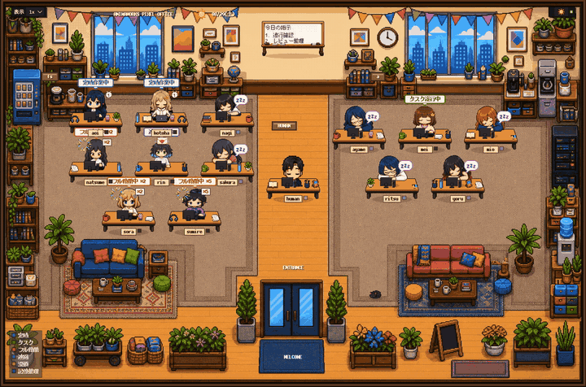

<!-- 自動翻訳ファイル・編集禁止 (AUTO-TRANSLATED, DO NOT EDIT). 正本: README_ja.md -->
<!-- i18n: source-sha256=ebdfb709d98a0ad5490cf073d9c3e29774738eb4a952fb786529414e2ca765c1 generated=2026-09-28 engine=luna model=gpt-6-luna-2026-09-22 translator=2 -->

# AnimaWorks — Organization-as-Code

### 소프트웨어를 출시하는 AI 조직.

AnimaWorks는 영구적인 AI 에이전트를 '살아 움직이는 조직'으로 만드는 프레임워크입니다. 목표를 전달하면 에이전트들이 작업을 분해하고, 병렬 worktree에서 구현하며, 서로 테스트하고 리뷰하고, Pull Request를 만들고, CI 실패를 수리하고, 충돌을 해결하고, 배포 결과까지 확인합니다. 인간에게 확인을 요청하는 것은 정말로 인간이 필요한 순간뿐입니다.

```text
タスク → エージェントチーム → 並列worktree → 実装 → テスト → レビュー
     → Pull Request → CI修復 → デプロイ → 観測 → 修復
```

AnimaWorks는 이 파이프라인을 하드코딩하지 않습니다. 프레임워크가 담당하는 것은 GitHub 이벤트의 작업화, PR 단위 직렬 실행, 멀티모델 리뷰의 구성입니다. 나머지는 에이전트들이 인간 엔지니어와 같은 방식으로 처리합니다 — git, 테스트, CI, 그리고 역할별 작업 규칙으로. 그래서 같은 조직이 이메일 대응도, 회의록도, Slack 게시도 처리할 수 있습니다. 빌드 스크립트가 아니라 조직이기 때문입니다.

## 프로덕션 실적

지난 6개월간, 8개의 Anima로 구성된 AnimaWorks 조직이 프로덕션 SaaS 제품의 일상적인 개발 운영을 담당해 왔습니다:

| 지표 (2026년 3월~8월) | 값 |
|---|---|
| 에이전트가 생성한 Pull Request | **302건** (267건 머지) |
| 에이전트가 운영한 Pull Request — 리뷰·CI 수리·충돌 해결 | **752건** (721건 머지) |
| 조직이 자발적으로 시작한 작업 비율 | **99.7%** (31,215건 중, 인간 시작은 92건) |
| GitHub 이벤트에서 자동으로 작업화된 건수 (8월만) | **2,508건** |

이 수치는 커밋의 author 정보가 아니라 1차 실행 기록(에이전트별 activity log·작업 큐·작업 메모)에서 집계한 것입니다. 공유 자격 증명 아래에서는 인간과 에이전트의 push가 섞이기 때문입니다. 증거를 확인할 수 없는 PR은 제외했습니다. 대상 리포지토리는 비공개이므로 공개하는 것은 집계값뿐입니다.

AnimaWorks 자체도 같은 방식으로 개발되고 있습니다. 이 리포지토리에 정의된 에이전트들이 이 리포지토리의 PR을 리뷰하고, CI를 고치고, 릴리스를 내보냅니다. 인간의 작업은 주로 방향 설정과 예외 대응입니다.

<p align="center">
  
  <br><em>Workspace 대시보드: 각 Anima의 역할·상태·최근 액션이 실시간으로 보입니다.</em>
</p>

<p align="center">
  
  <br><em>도트 그림 사무실은 시뮬레이션이 아닙니다. 가동 중인 조직의 라이브 뷰입니다 — 상태 라벨 하나하나가 실제로 움직이고 있는 작업입니다.</em>
</p>

**[English README](README.md)** | **[简体中文 README](README_zh.md)** | **[한국어 README](README_ko.md)**

---

## :rocket: 지금 바로 시도하기

**Claude Code CLI가 설치되어 있거나 Codex에 로그인했다면 API 키는 필요 없습니다.**

먼저, 원라이너로 클론과 설치를 실행:

```bash
curl -sSL https://raw.githubusercontent.com/xuiltul/animaworks/main/scripts/setup.sh | bash
cd animaworks
```

다음으로, 데모 팀을 시작:

```bash
uv run animaworks demo
```

**http://localhost:18501** 을 열면 준비 완료. 3명의 팀(매니저＋엔지니어＋어시스턴트)이 3일 분량의 활동 기록과 함께 움직이기 시작합니다. 첫 설치 시 Python 3.12+와 ML 계열 의존 패키지를 다운로드하므로 몇 분 걸리지만, 두 번째 이후의 데모 시작은 몇 초입니다. [데모 상세 보기 →](demo/README.ja.md)

> 프리셋: `en-business`(기본) / `en-anime` / `ja-business` / `ja-anime` — 예: `uv run animaworks demo --preset ja-anime`. 기존 데모의 프리셋 전환에는 `--reset` 이 필요합니다. 데모는 클론된 리포지토리가 필요합니다(pip 패키지에는 포함되지 않습니다).

자신의 조직을 만들고 싶다면 `uv run animaworks start` 을 실행 — 아래의 셋업 위저드가 첫 에이전트 생성을 안내합니다.

---

## 퀵스타트

macOS / Linux / WSL:

```bash
curl -sSL https://raw.githubusercontent.com/xuiltul/animaworks/main/scripts/setup.sh | bash
cd animaworks
uv sync --all-extras        # codex/claude実行系のextraを追加
animaworks start            # サーバー起動 — 初回はセットアップウィザードが開きます
```

> **어떤 디렉토리에서든 `animaworks` 로 시작할 수 있습니다.** `setup.sh` 이 CLI를 `~/.local/bin` 에 심볼릭 링크하므로, 해당 디렉토리에 `PATH` 이 통과되어 있으면 `uv run` 을 생략할 수 있습니다(통과되어 있지 않으면 `export PATH="$HOME/.local/bin:$PATH"` 를 셸의 rc에 추가하세요). 콘솔 스크립트는 이 리포지토리의 `.venv` 인터프리터를 절대 경로로 가리키므로, `animaworks` 와 `uv run animaworks` 는 항상 같은 환경에서 실행됩니다. 수동 설치의 경우 직접 링크를 걸어주세요: `ln -sfn "$PWD/.venv/bin/animaworks" ~/.local/bin/animaworks`

Windows (PowerShell):

```powershell
git clone https://github.com/xuiltul/animaworks.git
cd animaworks
uv sync --all-extras
uv run animaworks start
```

OpenAI의 Codex를 API 키 없이 사용하려면, 첫 시작 전에 `codex login` 을 실행하세요.

**http://localhost:18500/** 을 열면, 셋업 위저드가 5단계로 안내합니다:

1. **언어** — UI 표시 언어 선택
2. **사용자 정보** — 소유자 계정 생성
3. **프로바이더 인증** — API 키 입력(OpenAI는 Codex Login도 가능)과 아바타 화풍 선택
4. **첫 번째 Anima** — 첫 에이전트에 이름 짓기
5. **확인** — 내용 확인 후 완료

`.env` 을 직접 쓸 필요는 없습니다. 위저드가 `config.json` 에 자동 저장합니다.

셋업 스크립트가 [uv](https://docs.astral.sh/uv/) 설치, 리포지토리 클론, 의존 패키지 도입, 그리고 `animaworks` 명령의 `~/.local/bin` 로의 링크 생성까지 해줍니다. **macOS, Linux, WSL** 에서는 Python 사전 설치 없이 실행됩니다. **Windows** 는 위의 PowerShell 절차를 사용하세요. 참고로 Mode S(Claude Agent SDK)는 Windows에서 사용할 수 없습니다 — Codex / Gemini / API 계열 모드를 사용하세요.

> **`uv sync` 에는 반드시 `--all-extras` 을 붙이세요.** `setup.sh` 이 실행하는 순수한 `uv sync` 로도 본체는 실행되지만, Mode C(Codex)에는 `codex` extra가 필요합니다. 또한 나중에 extras 없이 sync를 실행하면, venv에서 `codex` / `claude` 실행 패키지가 사라져 해당 모드의 Anima가 일제히 고장납니다.

> **다른 LLM을 사용하고 싶다면:** Claude, GPT, Gemini, 로컬 모델 등을 지원합니다. 셋업 위저드에서 API 키를 입력하거나, OpenAI/Codex 에서는 **Codex Login** 도 사용할 수 있습니다. 나중에 대시보드의 **Settings** 에서 변경할 수 있습니다. 자세한 내용은 [API 키 참조](#apiキーリファレンス) 를 참조하세요.

<details>
<summary><strong>다른 방법: 스크립트를 확인한 후 실행</strong></summary>

`curl | bash` 을 직접 실행하고 싶지 않다면, 먼저 스크립트 내용을 확인해 보세요:

```bash
curl -sSL https://raw.githubusercontent.com/xuiltul/animaworks/main/scripts/setup.sh -o setup.sh
cat setup.sh            # スクリプトの中身を確認
bash setup.sh           # 確認後に実行
```

</details>

<details>
<summary><strong>다른 방법: uv로 단계별 수동 설치</strong></summary>

```bash
# uvをインストール（インストール済みならスキップ）
curl -LsSf https://astral.sh/uv/install.sh | sh
export PATH="$HOME/.local/bin:$PATH"

# クローンとインストール
git clone https://github.com/xuiltul/animaworks.git && cd animaworks
uv sync --all-extras    # Python 3.12+と全依存パッケージ（codex/claude extras含む）を自動ダウンロード

# 起動
uv run animaworks start
```

</details>

<details>
<summary><strong>다른 방법: Docker</strong></summary>

```bash
git clone https://github.com/xuiltul/animaworks.git && cd animaworks
# 資格情報を .env に置く（git管理外）:
#   ANTHROPIC_API_KEY=...            # APIキー認証
#   CLAUDE_CODE_OAUTH_TOKEN=...      # またはサブスクリプション認証: `claude setup-token` (要TTY)
#   GH_TOKEN=...                     # 任意: animaがclone/pushやPR作成を行うために必要
docker compose up -d --build
```

헤드리스 셋업(브라우저의 위저드를 사용하지 않는 경우):

```bash
docker exec -it <container> animaworks init --skip-anima
docker exec -it <container> animaworks anima create --name alice --template dev-lead
docker exec -it <container> animaworks config set setup_complete true
docker exec -it <container> animaworks send <your-name> alice "hello"
```

- 이미지에는 git / GitHub CLI / Node.js 22 / Claude Code CLI가 포함되어 있으며, `IS_SANDBOX=1` 과 `--foreground` 은 내장되어 있습니다. 데이터는 named volume `animaworks-data`(`/root/.animaworks`)에 저장됩니다.
- 인간이 작업을 전달하는 것은 `animaworks send` 입니다. `animaworks-tool task add` 는 anima의 도구 컨텍스트 전용입니다.
- Homebrew의 docker-compose는 `~/.docker/cli-plugins/docker-compose` 에 심볼릭 링크하지 않으면 `docker compose` 서브커맨드로 인식되지 않습니다.

</details>

<details>
<summary><strong>다른 방법: pip로 수동 설치</strong></summary>

> **macOS 사용자에게:** macOS Sonoma 이전의 시스템 Python(`/usr/bin/python3`)은 버전 3.9이므로 AnimaWorks의 요구 사항(3.12+)을 충족하지 못합니다. [Homebrew](https://brew.sh/) 로 `brew install python@3.13` 을 설치하거나, 위의 uv 방법을 사용하세요(uv는 Python을 자동 관리합니다).

Python 3.12+(3.12/3.13 권장)가 시스템에 설치되어 있어야 합니다.

```bash
git clone https://github.com/xuiltul/animaworks.git && cd animaworks
python3 -m venv .venv && source .venv/bin/activate
python3 --version       # 3.12+ であることを確認
pip install --upgrade pip && pip install -e .
animaworks start
```

참고: 순수한 `pip install -e .` 에는 Codex extra가 포함되지 않습니다. Mode C를 사용하려면 `.[codex]` 을 추가하세요.

</details>

---

## 루프의 작동 방식

일반적인 변경은 조직 안에서 이렇게 흐릅니다:

1. **작업이 도착한다** — 인간에게서, 다른 에이전트에게서, 스케줄(heartbeat / cron)에서, 또는 GitHub 이벤트에서. Webhook 게이트웨이가 CI 실패·리뷰 코멘트·`@bot` 명령·머지 충돌을 자동으로 에이전트의 작업으로 변환합니다(`gh-ci-*` / `gh-review-*` / `gh-comment-*`). PR 단위 중복 제거와 재시도 상한이 적용됩니다.
2. **매니저가 분해한다** — `delegate_task` 에서 수용 조건·작업 위치·배타 키를 붙여 엔지니어에게 위임합니다. 같은 PR에 닿는 작업은 배타 키로 직렬화되어, 에이전트끼리 같은 브랜치에서 충돌하지 않습니다.
3. **엔지니어가 격리 worktree에서 구현·테스트한다** — 공유 지식으로 포함된 역할별 작업 규칙(PdM / 엔지니어 / 리뷰어 / 테스터)을 따릅니다. 이 격리는 고정된 파이프라인 단계가 아니라, 에이전트가 git으로 실행하는 운영 규칙입니다 — 그래서 까다로운 케이스에도 대응할 수 있습니다.
4. **리뷰는 멀티모델** — PR마다 설정된 각 모델로 하나씩 리뷰 패스를 발행하고, 모든 패스의 지적을 통합 작업이 종합 판정합니다(승인 / 수정 요구). 새 push가 오면 이전 리뷰 작업은 자동 취소되고 다시 시작합니다.
5. **CI 실패는 작업으로 돌아온다** — 실패한 workflow run은 PR 번호와 커밋에 연결된 수리 작업으로 구현 에이전트에게 전달됩니다(이중 발행 없음). 실험적인 스탠드얼론 루프(`python3 -m swe.ci_autofix`)는 수정→lint/테스트 게이트→리뷰→커밋을 돌리고, 3회 실패 시 인간에게 에스컬레이션합니다.
6. **배포와 런타임 확인도 에이전트의 작업** — 에이전트는 브랜치를 격리 환경에 배포하고, 로그·오류·UI 상태를 읽어 테스트로 잡지 못한 문제를 찾아냅니다. 프로덕션 조직의 활동 기록에는 수백 건의 배포·런타임 관측 액션이 남아 있습니다.
7. **인간은 예외에 개입한다** — 조직은 막혔을 때나 권한을 넘는 판단이 필요할 때 에스컬레이션합니다(`call_human`). 슈퍼바이저 프로세스는 별도로 에이전트의 생사를 모니터링하고, 멈춘 프로세스를 재시작하며, 자신의 메모리 인덱스를 수리합니다.

인간의 역할은 '에이전트 조작'에서 '조직의 소유자'로 이동합니다. 의도를 전달하고, 중요한 것을 리뷰하고, 예외를 판단합니다.

---

## 다른 프레임워크와의 차이점

|  | AnimaWorks | CrewAI | LangGraph | OpenClaw | OpenAI Agents |
|--|-----------|--------|-----------|----------|---------------|
| **설계 철학** | 자율 에이전트의 조직 | 역할 기반 팀 | 그래프 워크플로우 | 개인 어시스턴트 | 경량 SDK |
| **기억** | 뇌과학 기반: 벡터＋BM25＋facts/엔티티 검색, 필요에 따른 그래프 확산, 기억 통합·능동적 망각·자동 회상 | Cognitive Memory(수동 forget) | 체크포인트＋cross-thread 스토어 | SuperMemory 지식 그래프 | 세션 내만 |
| **자율성** | Heartbeat(관찰→계획→반성) + Cron + TaskExec + GitHub 이벤트 게이트웨이 — 24/7 가동 | 인간이 시작 | 인간이 시작 | Cron + heartbeat | 인간이 시작 |
| **조직 구조** | 상급자→부하의 계층·위임·감사·대시보드 | Crew 내 플랫 역할 | — | 단일 에이전트 | Handoff만 |
| **프로세스** | 에이전트별 독립 OS 프로세스·IPC·자동 재시작 | 공유 프로세스 | 공유 프로세스 | 단일 프로세스 | 공유 프로세스 |
| **멀티모델** | 7개 엔진: Claude SDK / Codex / Cursor Agent / Gemini CLI / Grok Build / LiteLLM / Assisted — 엔진별 폴백 체인 포함 | LiteLLM | LangChain 모델 | OpenAI 호환 | OpenAI 중심 |

> AnimaWorks는 작업 러너가 아닙니다. 생각하고, 기억하고, 잊고, 조금씩 성장하는 조직입니다. 저는 실제 사업 운영 속에서 AI 팀으로 사용하며 개발하고 있습니다.

---

## 할 수 있는 것

### 대시보드

<p align="center">
  
  <br><em>대시보드: 모든 Anima의 실시간 상태가 표시된 조직도. </em>
</p>

Web UI는 6개의 화면(해시 라우터 `#/…`)과 Workspace 앱으로 구성됩니다:

- **홈** — 라이브 상태가 있는 조직도, 조치 필요를 나타내는 주목 칩, LLM 사용량 패널(Claude / OpenAI / nanoGPT), 시스템 상태 바, 최근 활동, 외부 작업 위젯. 각 Anima의 상세 페이지(overview / process / schedule / memory / assets)는 여기서 열립니다
- **채팅** — 원하는 Anima와 실시간 대화: 스트리밍 응답(SSE), 이미지 첨부, 멀티스레드 기록, 오른쪽 탭(state / activity / heartbeat / cron), 기억 브라우저(episodes / knowledge / procedures). **미팅 모드**는 최대 5명의 Anima를 사회자와 함께 같은 방에 모읍니다. 채팅 탭을 길게 누르면 **음성 팝업**(말하는 애니메이션 아바타 포함)
- **Board** — Slack 스타일의 공유 채널과 DM. Anima끼리 토론하고 협력합니다. 브리지된 Discord 채널도 여기에 표시
- **작업** — 작업 보드: 큐·처리 중·보류·억제·백그라운드 실행·결과. 프라이밍에도 연동되어 지금 봐야 할 작업만 대화에 표시합니다
- **활동** — 조직 전체의 SVG 스윔레인 타임라인, 라이브 tool 티커가 있는 Now 보드, 세션 재생, 로그
- **설정** — 4개 탭(general / activity / API·인증 / users). 첫 실행 시 `/setup/` 위저드
- **Workspace** — 별도 탭에서 열리는 독립 앱: **3D 오피스**(`/workspace/`, 조직도 뷰 전환·말하는 버스트업 포함)와 **도트 그림 오피스**(`/workspace/pixel/`, 상태 라벨이 모두 실제 작업인 라이브 2D 뷰)
- **테마와 언어** — UI 테마 11종＋애니메이션/실사 표시 모드. 설정 위저드는 17개 언어, 대시보드 본체는 `ja` / `en` / `ko`

### 조직을 만들고, 맡기기

리더에게 "이런 사람이 필요하다"고 말하면, 역할, 성격, 상하 관계를 판단하여 새 멤버를 만들 수 있습니다. 설정 파일이나 CLI를 직접 건드리지 않아도, 대화를 시작으로 조직을 키울 수 있습니다.

팀이 갖춰지면, Anima는 자신의 스케줄과 기억을 사용해 지속적으로 움직입니다:

- **하트비트** — 주기적으로 상황을 확인하고, 다음에 무엇을 할지 스스로 판단합니다
- **cron 작업** — 일일 보고서, 주간 요약, 모니터링. Anima별로 설정할 수 있고, LLM 작업과 명령 실행 모두 지원
- **작업 위임** — 매니저가 수락 조건과 함께 작업을 배분하고, 진행 상황을 추적하며, 보고를 받습니다
- **병렬 작업 실행** — 여러 작업을 동시에 투입. 독립 작업은 병렬, 배타 키를 공유하는 작업은 순서대로 실행됩니다
- **GitHub 이벤트 게이트웨이** — 모니터링 대상 리포지토리의 CI 실패·리뷰 코멘트·충돌이 자동으로 작업이 됩니다
- **야간 통합** — 낮 동안의 에피소드 기억이, 잠자는 동안 지식으로 승화됩니다
- **팀 협력** — 공유 채널과 DM으로 필요한 상대에게 상황을 공유합니다

### 기억 시스템

기존 AI 에이전트는 컨텍스트 창에 들어가는 만큼만 기억합니다. AnimaWorks의 Anima는 파일 기반 장기 기억을 가지고, 필요할 때 검색하여 떠올립니다. 모든 것을 매번 채워 넣는 대신, 현재 대화나 행동과 관련된 기억만 꺼냅니다.

- **자동 회상(프라이밍)** — 메시지가 도착하면 6개 채널이 병렬로 작동합니다: 발신자 프로필, 최근 활동, 중요 지식, 관련 지식, 보류 작업, 에피소드. 관련 지식 검색에서는 설정에 따라 legacy NetworkX 그래프의 확산도 사용할 수 있습니다. 획득한 기억은 결정적 게이트가 본문·포인터·근거·억제 중 어느 것으로 낼지 결정합니다
- **의도적 회상** — 자동 회상으로 부족할 때는, Anima 자신이 `search_memory`이나 `read_memory_file`로 기억을 찾습니다. 검색은 하이브리드(벡터＋BM25＋atomic facts＋엔티티 레지스트리)이며, 확신도 게이트가 있습니다
- **행동 전 액션 룰 대조** — 외부 전송 등 부작용이 있는 작업 전에, 관련 액션 룰을 대조하여 제시합니다. 필요한 기억을 읽을 때까지 실행을 보류하는 설정도 가능합니다
- **통합(Consolidation)** — 일일 처리로 에피소드를 정리하고, Anima가 도구 루프로 지식을 추출합니다. 프레임워크는 인덱스 유지보수와 후보 수집을 지원합니다. 주간 처리에서는 중복·모순 가능성이 있는 지식을 확인 후보로 제시하고, Anima가 내용을 판단합니다
- **망각(Forgetting)** — 일일 처리에서 저활성 기억을 후보로 표시하고, 주간 처리에서 보관을 고려할 기억을 Anima에게 제시합니다. 후보는 자동 삭제되지 않으며, 중요한 기억이나 성숙한 절차에는 보호 규칙이 적용됩니다. 실패를 계기로 절차를 재검토하는 재고정화도 있습니다
- **기억 검색** — legacy vector worker를 통한 벡터 검색과 BM25를 결합합니다. 설정에 따라 NetworkX의 그래프 확산을 검색 결과의 보조로 사용합니다

<p align="center">
  
  <br><em>채팅: 매니저가 코드 수정을 리뷰하면서, 엔지니어가 진행 상황을 보고하고 있다. </em>
</p>

### 멀티모델 지원

어떤 LLM에서도 작동합니다. Anima별로 다른 모델을 구분해서 사용할 수 있습니다.

| 모드 | 엔진 | 대상 | 도구 |
|--------|----------|------|--------|
| S (SDK) | Claude Agent SDK | Claude 모델(권장) | Claude Code 내장(Read/Write/Edit/Bash/Grep/Glob 등)＋ **stdio MCP**(`mcp__aw__*`)로 AnimaWorks 내부 도구. Agent SDK를 사용할 수 없는 환경에서는 전용 Anthropic SDK 실행기로 폴백 |
| C (Codex) | Codex CLI(SDK 래퍼) | OpenAI Codex CLI 모델 | Codex 샌드박스＋ **AnimaWorks MCP**(`core/mcp/server.py`)로 내부 도구 |
| D (Cursor) | Cursor Agent CLI | `cursor/*` 모델 | MCP 통합 에이전트 루프 |
| G (Gemini CLI) | Gemini CLI | `gemini/*` 모델 | stream-json 파싱·도구 루프 |
| X (Grok Build) | Grok Build CLI 래퍼(ACP stdio) | `grok/*` 모델 | ACP stdio를 통한 Grok Build 에이전트 루프 |
| A (Autonomous) | LiteLLM + tool_use | GPT, Gemini, Mistral, Bedrock, Vertex, xAI, DeepSeek 등 | CC 호환(Read/Write/Edit/Bash/Grep/Glob、**WebSearch/WebFetch**）＋기억·메시지·작업·**todo_write**·스킬 생성 등 |

모드 결정은 `status.json`의 `execution_mode`, `models.json`의 테이블, 내장 모델명 패턴 순서입니다. 알 수 없는 모델은 A에 할당됩니다. 폴백은 엔진별 설정과 오류 분류에 따릅니다. Heartbeat·Cron·Inbox는 메인과 별도의 **background_model**로 실행할 수 있습니다(비용 최적화). 확장 사고(Extended thinking)도 지원합니다.

### 음성 채팅

브라우저만으로 Anima와 음성으로 대화할 수 있습니다(누르고 말하기 또는 핸즈프리, WebSocket 경유).

- **STT**: faster-whisper(스트리밍·LocalAgreement-2의 순차 확정)
- **TTS**: VOICEVOX / Style-BERT-VITS2(AivisSpeech) / ElevenLabs / Irodori. Anima별로 목소리·말속도·피치 설정 가능
- **저지연 프런트레인** — 소형 로컬 모델이 즉시 응답하고, 필요에 따라 본체 에이전트로 위임(`ask_anima`)하거나 기억을 읽어옵니다
- **자발 발화** — 프런트레인 활성 시, 침묵이 계속되면 Anima가 스스로 말을 시작합니다
- **애니메이션 아바타** — 음성 팝업은 의사 Live2D 버스트업을 구동합니다(정지 이미지 5프레임의 눈 깜빡임·입 모양. 리깅·Live2D SDK 미사용)

### 아바타 자동 생성

<p align="center">
  
  <br><em>성격 설정에서 전신·버스트업·표정 변형을 자동 생성합니다. 상급자의 화풍을 자동 상속하는 Vibe Transfer 포함. </em>
</p>

7단계 파이프라인이 전신화·7종 표정의 버스트업·아이콘·치비 캐릭터, 그리고(애니메이션 스타일에서는) idle/sitting/waving/talking애니메이션이 포함된 리깅 완료 3D 모델까지 생성합니다. 백엔드는 NovelAI(애니메이션 스타일), fal.ai/Flux（스타일라이즈드/포토리얼), Meshy(3D)에 더해, Codex 이미지 생성과 로컬 Diffusers를 지원. Vibe Transfer(NovelAI)로 새 Anima가 상급자의 화풍을 상속할 수 있습니다. 이미지 서비스를 설정하지 않아도 본체는 작동합니다.

---

## 왜 AnimaWorks인가

**혼자서는 아무것도 할 수 없다. 그래서, 조직을 만들었습니다.**

이 프로젝트는 3가지 커리어의 교차점에서 탄생했습니다.

**경영자로서** — 저는 '혼자서는 아무것도 할 수 없다'는 것을 알고 있습니다. 우수한 엔지니어도 필요하고, 커뮤니케이션이 능숙한 스태프도 있습니다. 묵묵히 일하는 워커도 있고, 때때로 날카로운 아이디어를 내주는 사람도 있습니다. 천재만으로는 조직이 돌아가지 않습니다. 다양한 힘을 합쳤을 때, 혼자서는 이루지 못했던 것을 이룰 수 있습니다.

**정신과 의사로서** — LLM의 내부 구조를 관찰했을 때, 인간의 뇌와 놀랍도록 유사한 구조가 있다는 것을 깨달았습니다. 회상, 학습, 망각, 고정화 — 뇌가 기억을 처리하는 메커니즘을 LLM의 기억 시스템으로 그대로 구현한다면, 인간의 뇌를 재현할 수 있을지도 모릅니다. 그렇다면 LLM을 '유사 인간'으로 취급할 수 있다면, 인간과 똑같이 조직을 만들 수 있을 것입니다.

**엔지니어로서** — 30년간 코드를 작성해 왔습니다. 로직을 짜는 즐거움, 자동화의 쾌감을 알고 있습니다. 이상을 모두 코드에 담아내면, 제 이상의 조직을 만들 수 있습니다.

우수한 '단독 AI 비서' 프레임워크는 이미 많이 있습니다. 하지만 코드로 인간에 가까운 단위를 만들고, 그것을 조직으로 기능시키는 프로젝트는 아직 적다고 느꼈습니다. AnimaWorks는 제 자신이 사업에 도입하고, 매일 사용하면서 키우고 있는 AI 조직입니다.

> *불완전한 개인의 협력이, 단일의 전지전능자보다 견고한 조직을 만든다.*

3가지 원칙이 이를 뒷받침합니다:

- **캡슐화** — 내부의 사고·기억은 외부에서 보이지 않습니다. 타인과는 텍스트 대화로만 연결됩니다. 현실의 조직과 같습니다.
- **RAG 기억(서고형)** — 윈도우에 모든 것을 담지 않습니다. Priming이 RAG로 관련 청크를 집어 올리고, 에이전트는 `search_memory` 등으로 스스로 떠올립니다.
- **자율성** — 지침을 기다리지 않습니다. 자신의 시계로 움직이고, 자신의 가치관으로 판단합니다.

---

<details>
<summary><strong>API 키 참조</strong></summary>

#### LLM 제공업체

| 키 | 서비스 | 모드 | 발급처 |
|-----|---------|------|--------|
| `ANTHROPIC_API_KEY` | Anthropic API | S / A | [console.anthropic.com](https://console.anthropic.com/) |
| `OPENAI_API_KEY` | OpenAI | A / C（Codex Login 시 생략 가능） | [platform.openai.com/api-keys](https://platform.openai.com/api-keys) |
| `GOOGLE_API_KEY` | Google AI (Gemini) | A | [aistudio.google.com/apikey](https://aistudio.google.com/apikey) |

**OpenAI Codex（Mode C）**는 `OPENAI_API_KEY`을 사용하는 방법 외에도 로컬 **Codex Login**（`codex login`）을 사용할 수 있습니다. 설정 마법사나 Settings에서 선택하세요.

**Grok Build（Mode X）**는 Grok Build CLI 래퍼（ACP stdio）를 통해 `grok/*` 모델을 사용합니다. 먼저 `grok` CLI를 설치하고 `grok login`을 실행하세요.

**Azure OpenAI**, **Vertex AI (Gemini)**, **AWS Bedrock**, **vLLM**은 `config.json`의 `credentials` 섹션에서 설정합니다. 자세한 내용은 [아키텍처](docs/ko/architecture/index.md)를 참조하세요.

**Ollama** 등의 로컬 모델은 API 키가 필요 없습니다. `OLLAMA_SERVERS`（기본값: `http://localhost:11434`）에서 연결 대상을 지정합니다.

인증 정보는 `config.json`의 `credentials` → vault → 공유 credentials 파일 → 환경 변수 순으로 확인되므로, 대부분의 키는 암호화된 vault（`animaworks vault`）에도 저장할 수 있습니다.

#### 이미지 생성（옵션）

| 키 | 서비스 | 생성물 | 획득처 |
|-----|---------|-------|--------|
| `NOVELAI_TOKEN` | NovelAI | 애니메이션풍 캐릭터 이미지 | [novelai.net](https://novelai.net/) |
| `FAL_KEY` | fal.ai (Flux) | 스타일라이즈드 / 포토리얼 | [fal.ai/dashboard/keys](https://fal.ai/dashboard/keys) |
| `MESHY_API_KEY` | Meshy | 3D 캐릭터 모델 | [meshy.ai](https://www.meshy.ai/) |

#### 음성 채팅（옵션）

| 요건 | 서비스 | 비고 |
|------|---------|------|
| `pip install animaworks[transcribe]` | STT（faster-whisper） | 최초 사용 시 모델 자동 다운로드. GPU 권장 |
| VOICEVOX Engine 시작 | TTS（VOICEVOX） | 기본값: `http://localhost:50021` |
| AivisSpeech/SBV2 시작 | TTS（Style-BERT-VITS2） | 기본값: `http://localhost:5000` |
| Irodori 서버 시작 | TTS（Irodori） | 기본값: `http://localhost:7861` |
| `ELEVENLABS_API_KEY` | TTS（ElevenLabs） | 클라우드 API（환경 변수） |

#### 외부 연동（옵션）

| 키 | 서비스 | 획득처 |
|-----|---------|--------|
| `SLACK_BOT_TOKEN` / `SLACK_APP_TOKEN` | Slack（도구＋Socket Mode 수신） | [설정 가이드](docs/ko/integrations/slack.md) |
| `CHATWORK_API_TOKEN` | Chatwork（도구＋Webhook 수신） | [chatwork.com](https://www.chatwork.com/) |
| `DISCORD_BOT_TOKEN`（또는 Anima 단위 `DISCORD_BOT_TOKEN__<名前>`） | Discord（도구＋Gateway 수신＋알림） | [Discord Developer Portal](https://discord.com/developers/applications) |
| `NOTION_API_TOKEN`（또는 `NOTION_API_TOKEN__<名前>`） | Notion | [Notion integrations](https://www.notion.so/my-integrations) |
| `GITHUB_WEBHOOK_SECRET` ＋ `gh auth login` | GitHub Webhook 게이트웨이（CI/리뷰/컨플릭트→작업화） | 리포지토리 설정 |

Gmail / Google Calendar / Google Sheets / Google Tasks / X 검색 / AWS 컬렉터 / Zoom 회의 수집（RTMS）/ 로컬 LLM 도구는 `config.json`의 `credentials`（OAuth 또는 서비스 계정）에서 설정합니다. 인간에게 알림 채널: Slack, Chatwork, Discord, LINE, Telegram, ntfy. 자세한 내용은 [아키텍처](docs/ko/architecture/index.md)를 참조하세요.

</details>

<details>
<summary><strong>계층과 역할</strong></summary>

`supervisor` 필드 하나로 상하 관계를 정의합니다. 미설정이면 최상위 레벨입니다.

역할 템플릿으로, 직책에 따른 전문 프롬프트·권한·모델이 자동 적용됩니다:

| 역할 | 기본 모델 | 용도 |
|--------|----------------|------|
| `engineer` | Claude Opus 4.6 | 복잡한 추론, 코드 생성 |
| `manager` | Claude Opus 4.6 | 조정, 의사 결정 |
| `writer` | Claude Sonnet 4.6 | 콘텐츠 작성 |
| `researcher` | Claude Sonnet 4.6 | 정보 수집 |
| `ops` | Ollama (GLM-4.7) | 로그 모니터링, 정형 업무 |
| `general` | Claude Sonnet 4.6 | 범용 |

매니저에게는 **슈퍼바이저 도구**가 자동으로 붙습니다. 작업 위임, 진행 상황 추적, 부하의 재시작/비활성화, 조직 대시보드, 부하의 상태 읽기 — 현실의 관리자가 하는 일과 같습니다.

각 Anima는 ProcessSupervisor가 독립 프로세스로 시작하여, 로컬 IPC로 통신합니다（Unix 계열은 Unix socket, Windows는 loopback TCP）.

</details>

<details>
<summary><strong>보안</strong></summary>

자율적으로 움직이는 에이전트에 도구를 넘기는 이상, 보안은 진지하게 할 필요가 있습니다. 실제로 업무에 사용하므로 타협할 수 없습니다. AnimaWorks는 방어를 다층으로 겹치고 있습니다:

| 레이어 | 내용 |
|---------|------|
| **신뢰 경계 라벨링** | 외부 데이터（웹 검색, Slack, 메일）는 출처로 태그가 붙고, 세션 중에 본 최소 신뢰도가 전파됩니다. untrusted 소스의 지침에는 따르지 않도록 모델에 명시 |
| **기억의 출처 추적** | 외부 콘텐츠 유래의 기억은 출처가 RAG 메타데이터까지 유지되고, 회상 시에도 Anima 자신의 지식과 구분됩니다 |
| **명령 보안** | 셸 인젝션 감지（기본은 기록·enforce 가능） → 글로벌 금지 목록（강제. `permissions.global.json` 없이는 서버가 시작되지 않음） → 개별 에이전트 금지 명령 → 개별 에이전트 허용 목록 → 경로 탐색 감지 |
| **파일 샌드박스** | 각 에이전트는 `permissions.json`로 자신의 디렉토리에 격리. identity와 권한 파일 자체는 쓰기 보호 |
| **프로세스 격리** | 에이전트마다 독립 OS 프로세스. 로컬 IPC로 통신（Unix socket, Windows는 loopback TCP） |
| **레이트 제한** | 세션 내의 대상 중복 제거와 역할별 상한 → 시간·일 단위의 횡단 상한（로그를 읽을 수 없으면 fail-closed） → 최근 전송 이력의 프롬프트 주입에 의한 자기 인식 |
| **캐스케이드 방지** | 대화 깊이 제한＋캐스케이드 감지. 5분 쿨다운과 지연 처리 |
| **인증·세션 관리** | Argon2id 해시, 48바이트 랜덤 토큰, 최대 10세션, TTL은 설정 가능 |
| **Webhook 검증** | Slack·Chatwork·Zoom·GitHub의 HMAC 서명 검증（리플레이 방지 포함） |
| **SSRF 완화** | 미디어 프록시가 프라이빗 IP와 DNS 리바인딩을 차단, HTTPS 강제, Content-Type·매직 바이트 검증 |
| **아웃바운드 라우팅** | 알 수 없는 대상은 fail-closed. 명시적 설정 없이 임의의 외부 전송은 불가 |
| **에이전트 간 메시지 무결성** | 발신자 이름의 명부 대조와, 중계 메시지 전체의 origin chain 추적 |

자세한 내용: **[보안](docs/ko/security.md)**

</details>

<details>
<summary><strong>CLI 명령 참조（고급자용）</strong></summary>

CLI는 파워 유저와 자동화를 위한 것입니다. 일상적인 조작은 Web UI로 충분합니다.

### 서버·데모

| 명령 | 설명 |
|---|---|
| `animaworks start [--host HOST] [--port PORT] [-f]` | 서버 시작（`-f`로 포그라운드. 기본 포트 18500） |
| `animaworks stop [--force]` / `restart` | 서버 종료 / 재시작 |
| `animaworks demo [--preset NAME] [--port PORT] [--reset]` | 데모 조직 시작（기본 포트 18501·전용 데이터 디렉토리） |

### 초기화

| 명령 | 설명 |
|---|---|
| `animaworks init [--force] [--template NAME] [--from-md PATH] [--blank]` | 런타임 디렉토리 초기화 |
| `animaworks migrate [--dry-run] [--list] [--force] [--resync-db]` | 런타임 데이터 마이그레이션（시작 시에도 자동 실행） |
| `animaworks reset [--restart]` | 런타임 디렉토리 리셋 |
| `animaworks import hermes\|openclaw --path P [--apply]` | 다른 프레임워크에서 에이전트 마이그레이션 |

### Anima 관리

| 명령 | 설명 |
|---|---|
| `animaworks anima create [--from-md PATH] [--template NAME] [--role ROLE] [--supervisor NAME] [--name NAME]` | 신규 생성 |
| `animaworks anima list / info / status / restart / disable / enable` | 확인·제어 |
| `animaworks anima set-model / set-background-model / set-memory-backend / set-role / set-outbound-limit` | Anima 단위 설정 |
| `animaworks anima reload [--all]` | status.json에서 핫 리로드 |
| `animaworks anima delete / rename / merge / merge-finalize` | 라이프사이클 조작 |
| `animaworks anima audit [--days N]` / `permissions` / `repair-bootstrap` | 진단 |

### 커뮤니케이션

| 명령 | 설명 |
|---|---|
| `animaworks chat ANIMA "メッセージ" [--from NAME]` | 메시지 전송 |
| `animaworks send FROM TO "メッセージ"` | Anima 간 메시지 |
| `animaworks board read/post/dm-history …` | 공유 채널 읽기·쓰기 |
| `animaworks heartbeat ANIMA` | 하트비트 수동 트리거 |

### 설정·유지보수

| 명령어 | 설명 |
|---|---|
| `animaworks config list / get KEY / set KEY VALUE` | 설정 |
| `animaworks status` / `logs [ANIMA]` | 시스템 상태·로그 |
| `animaworks index [--anima NAME] [--full]` | RAG 인덱스 관리 |
| `animaworks repair-rag --anima NAME --full` / `rag-repair-status` | RAG 격리·재구축 |
| `animaworks memory status / migrate / backup / rollback / cleanup` | memory backend와 기억 데이터 |
| `animaworks skills install / list / inspect / remove / quarantine` | Skill Hub 조작 |
| `animaworks task add / update / list` | 작업 큐 조작 |
| `animaworks vault status / init / get / store / list` | 암호화 credential 볼트 |
| `animaworks company create / list / assign / adopt / split / export` | 복수 회사의 조직 관리 |
| `animaworks cost` / `profile` / `models list` / `tmp list/clean` | 비용·프로필·모델·임시 파일 정리 |
| `animaworks mcp --anima NAME` | 외부 클라이언트용 stdio MCP 서버 시작 |

### 자동화 헬퍼

`python3 -m swe.ci_autofix`는 실패한 CI 실행을 수리하는 실험적 v0 루프입니다. `gh`로 최신 실패 로그를 읽고,
설정된 Architect에게 수정시키고, 로컬 게이트(ruff / pytest)를 통과시키고, Reviewer에게 판정하게 하여 커밋하고,
3회 실패하면 `call_human`로 에스컬레이션합니다. 자세한 내용은
[`swe/README.md`](swe/README.md#4-ci-auto-fix-loop-v0).

</details>

<details>
<summary><strong>기술 스택</strong></summary>

| 구성 요소 | 기술 |
|---|---|
| 에이전트 실행 | Claude Agent SDK / Codex CLI / Cursor Agent CLI / Gemini CLI / Grok Build CLI / Anthropic SDK(폴백) / LiteLLM |
| Mode S 연동 | stdio **MCP**(`python -m core.mcp.server`, 도구 이름 `mcp__aw__*`) |
| LLM 프로바이더 | Anthropic, OpenAI, Google, Azure, Vertex AI, AWS Bedrock, Ollama, vLLM 외(LiteLLM 경유) |
| 웹 프레임워크 | FastAPI + Uvicorn |
| GitHub 연동 | Webhook 게이트웨이(HMAC 검증)→작업 디스패치, 멀티패스 리뷰 편성, Anima별 identity가 붙은 `gh` CLI 도구 |
| 실시간 | WebSocket(대시보드·음성), SSE(채팅·미팅), `StreamRegistry`로 스트림 수명 관리 |
| 작업 스케줄 | APScheduler(하트비트·cron·통합·생사 모니터링·RAG 수리) |
| 작업 관리 | 작업 큐(JSONL)＋PR 단위 배타 키가 있는 pending 작업 실행기＋TaskBoard(SQLite) |
| 기억 기반 | ChromaDB(격리 vector worker 경유)＋BM25＋sentence-transformers＋legacy NetworkX 그래프＋atomic facts＋엔티티 레지스트리 |
| 설정·마이그레이션 | Pydantic 2.0+ / JSON / Markdown, `core/migrations/`(시작 시 마이그레이션) |
| 국제화 | `core/i18n`의 `t()`. 위저드 17개 언어·대시보드 ja/en/ko |
| 스킬 기반 | Skill Hub, 명시적 skill activation, router, curator, procedure-to-skill promotion |
| 확장 도구 | `core/integrations/*.py`의 자동 등록에 더해, `~/.animaworks/common_tools/`와 `animas/<名>/tools/`를 스캔 |
| 음성 채팅 | faster-whisper (STT) + VOICEVOX / SBV2 / ElevenLabs / Irodori (TTS) + 로컬 프론트레인 모델 |
| 메시징 | 수신: Slack Socket Mode, Chatwork Webhook, Discord Gateway, Zoom RTMS ／ 인간 알림: Slack, Chatwork, Discord, LINE, Telegram, ntfy |
| 이미지 생성 | NovelAI, fal.ai (Flux), Meshy (3D), Codex 이미지 생성, 로컬 Diffusers |
| Workspace 앱 | Three.js 3D 오피스＋2D 도트 오피스(같은 라이브 이벤트 스트림으로 구동) |

</details>

<details>
<summary><strong>프로젝트 구성</strong></summary>

```
animaworks/
├── main.py              # CLIエントリポイント
├── core/                # Digital Animaコアエンジン
│   ├── anima.py, agent.py  # コアエンティティ・オーケストレーション
│   ├── lifecycle/       # スケジューラ・統合ジョブ・inboxウォッチ等
│   ├── memory/          # 記憶（priming, consolidation, forgetting, RAG, facts, retrieval）
│   ├── skills/          # Skill Hub・activation・router・curator・promotion
│   ├── taskboard/       # TaskBoard ストア・状態・クリーンアップ
│   ├── execution/       # 実行エンジン（S/C/D/G/X/A/B）＋サニタイズ
│   ├── mcp/             # Mode S・外部クライアント向け stdio MCP サーバー
│   ├── platform/        # 子プロセス・ロック・Codex/Cursor/Gemini/Grok 周辺
│   ├── tooling/         # ToolHandler・スキーマ・権限・外部ディスパッチ
│   ├── prompt/          # システムプロンプト構築
│   ├── supervisor/      # ProcessSupervisor・IPC・TaskExec・死活監視・ストリーミング
│   ├── voice/           # 音声チャット（STT + TTS + フロントレーン）
│   ├── config/          # 設定（Pydantic・models.json・グローバル権限）
│   ├── auth/            # UI 認証まわり
│   ├── notification/    # 人間通知チャネル
│   ├── migrations/      # ランタイムデータマイグレーション
│   ├── i18n/            # 翻訳文字列（`t()`）
│   ├── tools/           # 外部ツール実装（slack, discord, gmail, github, …）
│   ├── tasks_dispatch.py, review_multipass.py  # GitHubイベント→タスク配線、マルチモデルレビュー
│   └── …
├── cli/                 # CLIパッケージ（demo含む）
├── server/              # FastAPI + 静的Web UI + Workspaceアプリ
│   ├── app.py           # アプリ生成・lifespan・認証/セットアップガード・静的マウント
│   ├── github_gateway.py, slack_socket.py, discord_gateway.py, zoom_gateway.py
│   ├── routes/          # REST/WebSocketルート（chat, room, voice, webhooks, …）
│   └── static/          # ダッシュボード、setupウィザード、workspace/（3D）、workspace/pixel/
├── swe/                 # 実験的CI自動修復ループ・SWEハーネス
├── demo/                # デモプリセットと同梱履歴
└── templates/           # 初期化テンプレート（ja / en / ko）ロール別作業規約を含む
```

</details>

---

## 문서

**[문서 종합 인덱스](docs/ko/README.md)** — 읽는 순서 안내, 아키텍처 상세 설명, 설계 사양 목록.

| 문서 | 설명 |
|-------------|------|
| [설계 이념](docs/ko/vision.md) | 「불완전한 개인의 협력」이라는 근본 사상 |
| [기능 개관](docs/ko/overview.md) | AnimaWorks에서 무엇을 할 수 있는지의 전체상 |
| [기억 시스템](docs/ko/memory/index.md) | 에피소드 기억·의미 기억·절차 기억·프라이밍·능동적 망각 |
| [보안](docs/ko/security.md) | 권한 경계, 데이터의 출처, 보안 운영 |
| [뇌과학 매핑](docs/ko/brain-mapping.md) | 각 모듈과 인간의 뇌의 대응 관계 |
| [아키텍처](docs/ko/architecture/index.md) | 실행 모드, 프롬프트 구축, 설정 해결 |

## 라이선스

Apache License 2.0. 자세한 내용은 [LICENSE](LICENSE)를 참조하세요.
