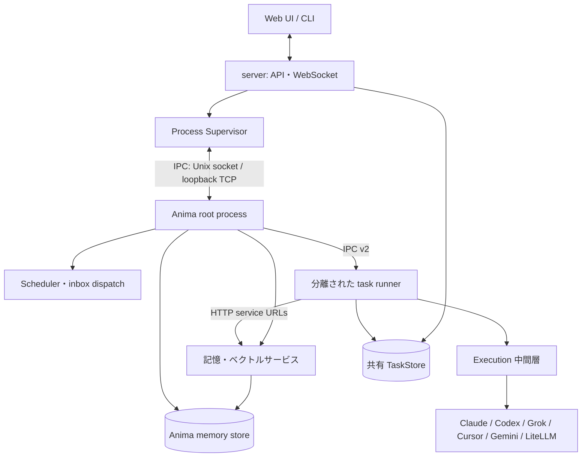

<!-- 自動翻訳ファイル・編集禁止 (AUTO-TRANSLATED, DO NOT EDIT). 正本: docs/ja/architecture/index.md -->
<!-- i18n: source-sha256=18da910af6fa2d8159875d19dec5df901e0d3af2207b6c79d7b4b968ac8a1571 generated=2026-10-06 engine=luna model=gpt-6-luna-2026-09-22 translator=2 -->

> Confirmed commit: b304b7dc

# Architecture

AnimaWorks consists of a server that provides an HTTP API and Web UI, a supervisor that manages the processes of each Anima, a root process for each Anima, a task runner that is isolated per request, and multiple LLM execution engines. Memory search and updates, as well as task persistence, are handled through their respective shared boundaries.

## Repository Structure

The main packages of `core/` are as follows. For a module-level list, see the [Module Reference](../reference/modules.md).

| Package | Role |
|---|---|
| `core.agent` | Agent conversation cycle, executor, pre-context construction |
| `core.anima` | Anima runtime objects, messages, heartbeat, lifecycle |
| `core.auth` | User authentication and sessions |
| `core.config` | Configuration schema, loading, resolution, migration |
| `core.execution` | Engine common events, sessions, processes, watchdog, tool evidence |
| `core.i18n` | Localized strings and translation functions |
| `core.infra` | Startup preparation, logging, runtime foundation |
| `core.integrations` | External service integration and animaworks-tool implementation |
| `core.lifecycle` | Common lifecycle processing and Anima integration |
| `core.mcp` | Server that exposes AnimaWorks tools via MCP |
| `core.memory` | Conversation records, long-term memory, search, memory maintenance |
| `core.messaging` | Internal messages, shared channels, sending to external destinations |
| `core.migrations` | Incremental migration of runtime data |
| `core.notification` | Human-facing notifications and interactive confirmation |
| `core.org` | Company, organization, and workspace resolution |
| `core.platform` | Abstraction of OS, process, lock, and file operation differences |
| `core.prompt` | Assembly of system prompts and tool guides |
| `core.runtime` | Anima main runtime components, inter-process communication, task execution |
| `core.skills` | Skill indexing, selection, lifecycle |
| `server.supervisor` | Server-side supervision, recovery, and scheduling of anima processes |
| `core.tasks` | Persistent tasks, execution queues, delegation, external task collection |
| `core.tooling` | Internal tool definitions, execution handlers, permission checks |
| `core.usage` | Usage and cost aggregation |
| `core.voice` | Voice input/output and voice conversation |

`server/` contains the FastAPI application, routes, gateway, and the Web UI it serves. `cli/` contains the `animaworks` command and terminal UI. `templates/` holds locale-specific prompts, Anima templates, and shared configuration templates.

## Runtime Data

The default data root is `~/.animaworks/`. It can be changed via the environment variable `ANIMAWORKS_DATA_DIR` or the CLI option `--data-dir`. The code resolves the root and its subpaths through `core/paths.py`.

| Path | Purpose |
|---|---|
| `config.json` | Application-wide configuration |
| `models.json` | Additional model name patterns and per-model metadata |
| `permissions.global.json` | Common permission constraints applied to all Anima |
| `animas/{name}/` | Per-Anima configuration, memory, and status. See [Anima Files](anima-files.md) for details |
| `shared/` | Data shared across multiple Anima, such as inbox, shared channels, and TaskStore |
| `common_knowledge/` | Knowledge materials shared between Anima |
| `common_skills/` | Common skills |
| `logs/` | Logs for server, Anima, and task runners |

The authoritative source for each Anima's per-anima configuration is `status.json`; for the meaning of model-related keys, refer to the [Configuration Reference](../reference/config.md). This chapter does not enumerate all configuration keys.
