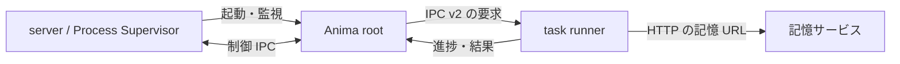

<!-- 自動翻訳ファイル・編集禁止 (AUTO-TRANSLATED, DO NOT EDIT). 正本: docs/ja/architecture/process.md -->
<!-- i18n: source-sha256=e6b11623e2b03592045b7e02748eaa29ee57557f00231db8bfd2f942f4b702d9 generated=2026-10-01 engine=local model=deepseek-v4-flash translator=2 -->

> Confirmed commit: b304b7dc

# Process Structure and Communication

The runtime assumes the phase3 process structure. The server provides API and WebSocket, and the Process Supervisor within the same server manages the Anima root process. The root has a scheduler and control IPC, and passes conversations and background processing to a separate task runner.

## Startup and IPC

`server/supervisor/manager.py` starts the root process, and `core/runtime/runner.py` initializes Anima's runtime objects and each service. `core/runtime/task_runner_supervisor.py` starts an independent task runner for each request, executing heartbeat, cron, inbox, chat, greet, background tasks, and others separately.

Control communication between root and server goes through `core/runtime/ipc.py`. `core/runtime/ipc_v2.py` handles requests and responses between root and task runners, and `core/runtime/transport.py` selects the connection method. Unix domain sockets are normally used, with loopback TCP on Windows. If the Unix socket path exceeds the OS length limit, it also switches to loopback TCP.

The connection destination needed for vector search is prepared as a URL by the server at startup and passed to the task runner. Root manages access to memory data, and child processes search via the service. See `docs/ja/memory/retrieval.md` for details on the search path.

## Startup Preparation and Readiness

The server does not make all APIs available immediately after startup; it proceeds with RAG preflight and Anima process startup. During preparation, startup progress is updated, and the readiness gate returns a progress screen. The Anima root continues initialization even after creating the IPC endpoint, and receives supervisor confirmation after ping returns ready. Public readiness does not become ready until heavy startup preparation and dependency service initialization are complete.

## Abnormal Shutdown and Restart

The state machine in `server/supervisor/restart_state.py` centrally manages the consecutive failure count, next restart time, and last error for each Anima. After a specified number of failures, FAILED is displayed in the UI, but automatic recovery continues. The restart interval is extended with exponential backoff, capped at 30 minutes. The failure count is reset after a period of stable operation.

The engine's event idle timeout applies when no engine event arrives for 1200 seconds. This is not a limit on the total execution time of a conversation. The task runner's shutdown and response monitoring are handled by the supervisor on the root side.
