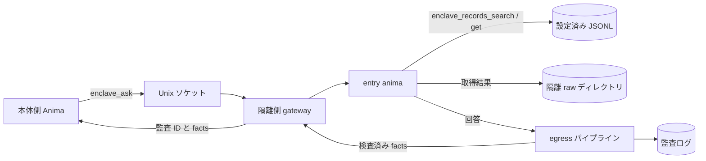

<!-- 自動翻訳ファイル・編集禁止 (AUTO-TRANSLATED, DO NOT EDIT). 正本: docs/ja/enclave.md -->
<!-- i18n: source-sha256=e0e849bf679433cb0719115b1647f8ecdaab5449752603969f8a9185295cc2de generated=2026-10-10 engine=luna model=gpt-6-luna translator=2 -->

> Confirmed commit: f448d7b0

# Building and Operating an Enclave

An enclave is a mechanism that isolates Anima, which handles personal information from SaaS, from the main execution environment. Data references are limited to JSONL files on the isolated side, and communication with the main body is limited to Unix domain sockets. Responses returned to the outside are inspected by the egress pipeline, and you can review the aggregated results and audit records.

## Overview



On the isolated side, `enclave_records_search` and `enclave_records_get` read only configured datasets, save retrieved records and the full text of various tools to `raw_dir`, and return `raw_path`. Search results are stored in `records`, and single-record retrieval results in `record`. The default save location is `ANIMAWORKS_DATA_DIR/raw/YYYYMMDD`, with directory mode `0700` and file mode `0600`. Dataset paths are restricted to `ANIMAWORKS_DATA_DIR`. The host receives no JSONL contents, and the Web UI displays only the connection status and the number of successful and blocked operations for the current day.

## OS Users and Groups

The following is an example for Linux. User, group, and systemd operations are performed with administrator privileges.

```bash
groupadd --system animaworks-enclave
useradd --system --create-home --home-dir /home/aw-enclave \
  --gid animaworks-enclave --shell /usr/sbin/nologin aw-enclave
```

Add the OS user that the main-side service uses to connect to the socket to the group. Replace `<host-user>` with the actual user name of the main-side service.

```bash
HOST_USER=host-service-user  # 本体側サービスの実ユーザー名に置き換える
usermod --append --groups animaworks-enclave "$HOST_USER"
id -u "$HOST_USER"
```

Specify the displayed UID in `allowed_peer_uids` on the isolated side. After adding the group, restart the main-side service to reflect the new supplementary group. The data directory and anima directory on the isolated side must be owned by the execution user and have permissions that prevent other users from reading them. If there is a violation of the startup guard, `doctor` will display the reason.

## Isolated-Side Configuration

Set `enclave` in the isolated user's `~/.animaworks/config.json`. `datasets.<name>.path` is a relative path from the data directory and specifies a `.jsonl` file. Items not in `searchable_fields` are not included in search.

```json
{
  "enclave": {
    "enabled": true,
    "raw_dir": "raw",
    "name": "saas-data",
    "socket_path": "/run/animaworks-enclave/aw-enclave.sock",
    "socket_group": "animaworks-enclave",
    "entry_anima": "entry-anima",
    "allowed_peer_uids": [1001],
    "allowed_llm_credentials": ["anthropic"],
    "max_concurrency": 2,
    "request_timeout_s": 900,
    "datasets": {
      "customers": {
        "path": "data/customers.jsonl",
        "id_field": "customer_id",
        "searchable_fields": ["customer_id", "name", "kana", "email"]
      },
      "tickets": {
        "path": "data/tickets.jsonl",
        "id_field": "ticket_id",
        "searchable_fields": ["ticket_id", "customer_id", "category", "body"]
      }
    },
    "egress": {
      "stages": [{"type": "masker", "profile": "default"}]
    }
  }
}
```

In `allowed_llm_credentials`, list only the authentication credential names actually used by each anima on the isolated side. `external_tasks.enabled` defaults to `true`, so set it to `false` on the isolated side. For newly created anima, `permissions.json` is set to `["/"]` by `file_roots`, so change it to the necessary scope, such as the anima's own directory (otherwise, the startup guard will reject startup). In isolated mode, the Slack, Discord, Zoom, and GitHub Webhook gateways are not started. Other startup guards must also be satisfied, so do not enable event exports or external messaging integrations, and restrict file access to the necessary scope in each anima's `permissions.json`. If restricting external tools for the entry anima, allow `enclave_records`.

For authentication, use password mode in `auth.json` and configure it not to trust localhost. Do not store the password in plaintext; set `password_hash` to the Argon2id hash generated by the application.

```json
{
  "auth_mode": "password",
  "trust_localhost": false,
  "owner": {
    "username": "operator",
    "password_hash": "$argon2id$v=19$m=65536,t=3,p=4$<salt-and-hash>",
    "role": "owner"
  },
  "users": [],
  "sessions": {},
  "token_version": 1,
  "secret_key": ""
}
```

The value of `password_hash` is a format placeholder and must not be used as-is. If you created an authentication user in the Web UI's user settings, retain the generated hash.

## Starting with systemd

`templates/_shared/systemd/animaworks-enclave@.service` is a template that uses `%i` as the execution user name. Replace the virtual environment path and port in `ExecStart` according to the deployment location, and place it in the systemd unit directory with administrator privileges.

```bash
install -m 0644 templates/_shared/systemd/animaworks-enclave@.service \
  /etc/systemd/system/animaworks-enclave@.service
systemctl daemon-reload
systemctl enable --now animaworks-enclave@aw-enclave.service
```

The template sets `User=%i`, a dedicated `RuntimeDirectory`, `UMask=0077`, `NoNewPrivileges=yes`, `PrivateTmp=yes`, and `ProtectSystem=strict`. The write destination is limited to `/home/%i/.animaworks`, and `ProtectHome=tmpfs` and `BindPaths=/home/%i` expose only that user's home directory. The example HTTP port should be a value that does not conflict with the main side. Since the gateway communicates via a Unix socket, the HTTP bind address is limited to loopback.

## Main-Side Connection Configuration

Register the connection destination in `config.json` on the main side. `allowed_animas` is an allow-list of main-side animas that can call `enclave_ask`. An empty list allows no one.

`allowed_animas` is an application-layer restriction. The OS boundary is the socket's group permission (0660) and the connection source uid that the gateway verifies with `SO_PEERCRED` (`allowed_peer_uids`); any process with the same uid can connect to the socket. Keep the number of users who can be added to the socket group on the main side to a minimum.

```json
{
  "enclaves": {
    "saas-data": {
      "socket_path": "/run/animaworks-enclave/aw-enclave.sock",
      "allowed_animas": ["host-assistant"],
      "timeout_s": 900
    }
  }
}
```

If external tools are restricted in the main-side anima's `permissions.json`, add the module name `enclave` to `external_tools.allow`.

```json
{
  "external_tools": {
    "allow_all": false,
    "allow": ["enclave"],
    "deny": []
  }
}
```

## Inspection and Audit

Run the following on the isolated side. `doctor` checks the startup guards, socket types, modes, and groups, gateway `/v1/health`, egress pipeline configuration, and imports of `fugashi` and `ipadic`. If `enclaves` is configured on the main side, it also checks each socket's connection and health response. On problems, it exits with code 1; with `--json`, it returns machine-readable results.

```bash
animaworks enclave doctor
animaworks enclave doctor --json
animaworks enclave status
```

`status` outputs only the number of successful and blocked operations for the current day and does not display the contents of questions or answers. The egress audit log is saved to `~/.animaworks/enclave/audit/egress/YYYYMMDD.jsonl`, and the full text of retrieved results to `~/.animaworks/raw/YYYYMMDD/`. Because the audit log and raw files contain the facts and raw data being processed, maintain access permissions and do not copy them outside the isolated environment.

## Connecting to Real Data Sources

From the isolated side, you can reference a production MySQL-compatible DB in read-only mode. The connection cannot be written with real examples of the data handled (since this is a public repository, do not write customer names, industries, real host names, IPs, or account IDs). Everything below is a placeholder using `example`.

### Where to Store Secrets

Pass the DB password, AWS access key, and Laravel APP_KEY only to the isolated process through `enclave.secrets_dir` or systemd's `LoadCredential=`. Secret files should be root-owned and have mode `0600`. Do not write secret values in plaintext in configuration files. Put one key per line in the Laravel APP_KEY file, with the current key first and old keys on subsequent lines.

- When using systemd: use `LoadCredential=` in `animaworks-enclave@.service` to load `/etc/credstore/animaworks-enclave/<name>/db-password` and other secrets, making them readable from `$CREDENTIALS_DIRECTORY`.
- If you specify a different directory for `enclave.secrets_dir`, use the same format and place each value in a file named after the secret.

```bash
install -m 0600 -o root -g root db-password /etc/credstore/animaworks-enclave/aw-enclave/db-password
install -m 0600 -o root -g root aws-creds  /etc/credstore/animaworks-enclave/aw-enclave/aws-creds
```

### sql_sources Configuration Example

Define a read-only data source in `enclave.sql_sources`. `password_secret` is the secret name. If you set `tunnel`, it connects to RDS through SSM Session Manager port forwarding (via a bastion host). The contents of `aws_secret` are JSON in the `{"aws_access_key_id": "...", "aws_secret_access_key": "..."}` format.

```json
{
  "enclave": {
    "enabled": true,
    "secrets_dir": null,
    "sql_sources": {
      "main-db": {
        "driver": "mysql",
        "host": "example.rds.example.amazonaws.com",
        "port": 3306,
        "database": "example_db",
        "user": "enclave_reader",
        "password_secret": "db-password",
        "ssl": true,
        "max_rows": 200,
        "timeout_s": 30,
        "cell_max_chars": 2000,
        "app_key_secret": "laravel-app-keys",
        "decrypt_columns": ["^request$", "^body$", "^title$"],
        "tunnel": {
          "type": "ssm_port_forward",
          "region": "example-region-1",
          "target_tag_name": "example-bastion-tag",
          "aws_secret": "aws-creds",
          "plugin_path": "/usr/local/bin/session-manager-plugin",
          "idle_shutdown_s": 600
        }
      }
    }
  }
}
```

`app_key_secret` is the name of the secret file that stores Laravel APP_KEY values, one key per line. It handles `base64:` format and UTF-8 keys, trying the first line as the current key and subsequent lines as old keys. `decrypt_columns` is a regular expression used to match result column names (after aliases are applied) with `re.search`. For string cells in matching columns, it attempts decryption in Laravel AES-256-CBC format; values that cannot be decrypted are returned unchanged. SQL result rows are saved to a raw file after decryption and before cell truncation, and the full text can be read from `raw_path` in the tool result. SSL is required by default. If using an RDS CA, set `ssl_ca` to the CA path. If host name verification must be disabled, consider that the host name will not match through the tunnel, and leave `ssl_verify_identity: false` at its default value.

### Reading the doctor

Setting `sql_sources` adds an inspection of each source to `animaworks enclave doctor`. The startup guard does not stop startup even if secrets are not yet placed; the doctor displays `fail` (for operations where secrets can be placed later).

- `<name>.secrets`: Whether the secret files of `password_secret` and `tunnel.aws_secret` can be read.
- `<name>.plugin`: Whether `session-manager-plugin` is executable.
- `<name>.deps`: Whether `pymysql` and `boto3` can be imported.

It does not connect to the actual DB or AWS.

## AWS Read-Only Sources

Register CloudWatch Logs, RDS Performance Insights, RDS log files, and S3 read targets in `enclave.aws_sources`. Credentials are loaded from the secret file specified in `aws_secret`; AWS keys are not included in configuration files or tool output. All names and values below are explanatory placeholders.

```json
{
  "enclave": {
    "enabled": true,
    "secrets_dir": null,
    "aws_sources": {
      "observability": {
        "region": "example-region-1",
        "aws_secret": "aws-readonly",
        "log_groups": ["/example/application/*"],
        "pi_resource_id": "db-example-resource",
        "rds_instance_id": "db-example-instance",
        "s3_buckets": ["example-placeholder-bucket"],
        "max_bytes": 200000
      }
    }
  }
}
```

Set the contents of the secret `aws-readonly` file to the following JSON format. The values are illustrative placeholders; do not use them as-is.

```json
{"aws_access_key_id":"<access-key>","aws_secret_access_key":"<secret-key>"}
```

`log_groups` permits exact matches or prefix matches using a trailing `*`. The PI and RDS tools each use only their configured resource IDs, and S3 accesses only the buckets listed in `s3_buckets`. Times can be specified in ISO8601 or relative `-1h` / `-24h` format. Logs Insights queries are polled for up to 60 seconds, and the text returned by each tool is limited by `max_bytes`. AWS tools save the full text and records before truncation to `raw_dir`, which can be read from `raw_path` in the result. For non-text S3 objects or objects exceeding the limit, the contents are not included in the tool response; they are also saved to the existing `enclave/downloads/<bucket>/<key-sha256>` with mode `0600`.

The AWS source `doctor` check verifies `aws_sources.<name>.secret` and `.deps` (`boto3`). It does not connect to AWS; it only checks that the secret exists and that the SDK can be imported.

## Verification with Mock Data

The mock data generation script uses a fixed seed and regenerates the same 100 customer records and 300 inquiry tickets. Some tickets include names and phone numbers in the body. No real data is used, and the output destination is within the isolated side's data directory.

```bash
DATA_DIR="$HOME/.animaworks"
uv run python scripts/enclave/make_mock_dataset.py --out "$DATA_DIR/data"
```

Confirm that `datasets` in the isolated-side config points to the above `data/customers.jsonl` and `data/tickets.jsonl`, and make the entry anima able to use `enclave_records_search` and `enclave_records_get`. Then proceed with the following.

1. Run `animaworks enclave doctor` on the isolated side and check the guard and gateway status.
2. Register the connection destination in `config.json` on the main side, and allow `enclave` for the main-side anima.
3. Run `animaworks-tool enclave ask --enclave saas-data --question "問い合わせをカテゴリ別に要約して"` from the main side. Confirm that the entry anima searches the mock data and returns an egress-inspected answer.
4. Run `animaworks enclave status` on the isolated side and confirm that the success count has increased. The Web UI home screen displays only the connection status and aggregated counts.
