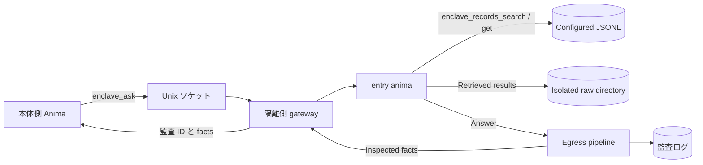

<!-- 自動翻訳ファイル・編集禁止 (AUTO-TRANSLATED, DO NOT EDIT). 正本: docs/ja/enclave.md -->
<!-- i18n: source-sha256=6180702228ee9130f88f8ee743f43290528d080237780c8224d9faa4d5a3b5bf generated=2026-10-09 engine=local model=deepseek-v4-flash translator=2 -->

> Confirmed commit: f448d7b0

# Building and Operating an Enclave

An enclave is a mechanism that isolates Anima, which handles personal information from SaaS, from the main execution environment. Data references are limited to JSONL files on the isolated side, and communication with the main body is limited to Unix domain sockets. Responses returned to the outside are inspected by the egress pipeline, and you can review the aggregated results and audit records.

## Overview



The isolated-side `enclave_records_search` and `enclave_records_get` read only configured datasets. Search results are returned under `records`, and a fetched item under `record`. Retrieved records and full results from the data tools are saved under `raw_dir`, and the tools return a `raw_path`. By default, files are stored in `ANIMAWORKS_DATA_DIR/raw/YYYYMMDD` with directory mode `0700` and file mode `0600`. Dataset paths are restricted to within `ANIMAWORKS_DATA_DIR`. The host side does not receive the JSONL body; the Web UI only displays the connection status and the day's success and blocked counts.

## OS Users and Groups

The following is an example for Linux. User, group, and systemd operations are performed with administrator privileges.

```bash
groupadd --system animaworks-enclave
useradd --system --create-home --home-dir /home/aw-enclave \
  --gid animaworks-enclave --shell /usr/sbin/nologin aw-enclave
```

Add the OS user that the main-side service uses to connect to the socket to the group. Replace `<host-user>` with the actual user name of the main-side service.

```bash
HOST_USER=host-service-user  # 本体側サービスの実ユーザー名に置き換える
usermod --append --groups animaworks-enclave "$HOST_USER"
id -u "$HOST_USER"
```

Specify the displayed UID in `allowed_peer_uids` on the isolated side. After adding the group, restart the main-side service to reflect the new supplementary group. The data directory and anima directory on the isolated side must be owned by the execution user and have permissions that prevent other users from reading them. If there is a violation of the startup guard, `doctor` will display the reason.

## Isolated-Side Configuration

Set `enclave` in the isolated user's `~/.animaworks/config.json`. `datasets.<name>.path` is a relative path from the data directory and specifies the `.jsonl` file. Items not in `searchable_fields` are not search targets.

```json
{
  "enclave": {
    "enabled": true,
    "raw_dir": "raw",
    "name": "saas-data",
    "socket_path": "/run/animaworks-enclave/aw-enclave.sock",
    "socket_group": "animaworks-enclave",
    "entry_anima": "entry-anima",
    "allowed_peer_uids": [1001],
    "allowed_llm_credentials": ["anthropic"],
    "max_concurrency": 2,
    "request_timeout_s": 900,
    "datasets": {
      "customers": {
        "path": "data/customers.jsonl",
        "id_field": "customer_id",
        "searchable_fields": ["customer_id", "name", "kana", "email"]
      },
      "tickets": {
        "path": "data/tickets.jsonl",
        "id_field": "ticket_id",
        "searchable_fields": ["ticket_id", "customer_id", "category", "body"]
      }
    },
    "egress": {
      "stages": [{"type": "masker", "profile": "default"}]
    }
  }
}
```

In `allowed_llm_credentials`, list only the authentication information names that each anima on the isolated side actually uses. `external_tasks.enabled` has an initial value of `true`, so set it to `false` on the isolated side. Since the `permissions.json` of a newly created anima has `file_roots` set to `["/"]`, rewrite it to the necessary scope, such as the anima's own directory (if left as is, the startup guard will refuse to start). In isolated mode, the Slack, Discord, Zoom, and GitHub Webhook gateways are not started. Other startup guards must also be satisfied, so do not enable event export or external message integration, and restrict file access to the necessary scope in each anima's `permissions.json`. To restrict external tools for the entry anima, allow `enclave_records`.

For authentication, use the password mode of `auth.json` and configure it not to trust localhost. Do not store plaintext passwords; set the Argon2id hash generated by the app in `password_hash`.

```json
{
  "auth_mode": "password",
  "trust_localhost": false,
  "owner": {
    "username": "operator",
    "password_hash": "$argon2id$v=19$m=65536,t=3,p=4$<salt-and-hash>",
    "role": "owner"
  },
  "users": [],
  "sessions": {},
  "token_version": 1,
  "secret_key": ""
}
```

The value of `password_hash` is a placeholder indicating the format; do not use it as is. If you create an authentication user in the Web UI user settings, keep the generated hash.

## Starting with systemd

`templates/_shared/systemd/animaworks-enclave@.service` is a template that uses `%i` as the execution user name. Replace the virtual environment path and port in `ExecStart` according to the deployment location, and place it in the systemd unit directory with administrator privileges.

```bash
install -m 0644 templates/_shared/systemd/animaworks-enclave@.service \
  /etc/systemd/system/animaworks-enclave@.service
systemctl daemon-reload
systemctl enable --now animaworks-enclave@aw-enclave.service
```

The template sets `User=%i`, a dedicated `RuntimeDirectory`, `UMask=0077`, `NoNewPrivileges=yes`, `PrivateTmp=yes`, and `ProtectSystem=strict`. The write destination is limited to `/home/%i/.animaworks`, and `ProtectHome=tmpfs` and `BindPaths=/home/%i` expose only that user's home directory. The example HTTP port should be a value that does not conflict with the main side. Since the gateway communicates via a Unix socket, the HTTP bind address is limited to loopback.

## Main-Side Connection Configuration

Register the connection destination in `config.json` on the main side. `allowed_animas` is an allow-list of main-side animas that can call `enclave_ask`. An empty list allows no one.

`allowed_animas` is an application-layer restriction. The OS boundary is the socket's group permission (0660) and the connection source uid that the gateway verifies with `SO_PEERCRED` (`allowed_peer_uids`); any process with the same uid can connect to the socket. Keep the number of users who can be added to the socket group on the main side to a minimum.

```json
{
  "enclaves": {
    "saas-data": {
      "socket_path": "/run/animaworks-enclave/aw-enclave.sock",
      "allowed_animas": ["host-assistant"],
      "timeout_s": 900
    }
  }
}
```

If external tools are restricted in the main-side anima's `permissions.json`, add the module name `enclave` to `external_tools.allow`.

```json
{
  "external_tools": {
    "allow_all": false,
    "allow": ["enclave"],
    "deny": []
  }
}
```

## Inspection and Audit

On the isolated side, run the following. `doctor` checks the startup guard, socket type, mode, and group, the gateway's `/v1/health`, the egress pipeline configuration, and the imports of `fugashi` and `ipadic`. If `enclaves` is configured on the main side, it also checks each socket's connection and health response. If there is a problem, exit code 1 is returned, and `--json` returns machine-readable results.

```bash
animaworks enclave doctor
animaworks enclave doctor --json
animaworks enclave status
```

`status` outputs only the day's success and blocked counts and does not display the question or answer body. The egress audit log is saved in `~/.animaworks/enclave/audit/egress/YYYYMMDD.jsonl`; complete tool results are saved in `~/.animaworks/raw/YYYYMMDD/`. Audit and raw files can contain facts and unmodified source data, so preserve their access permissions and do not copy them outside the isolated environment.

## Connecting to Real Data Sources

From the isolated side, you can reference a production MySQL-compatible DB in read-only mode. The connection cannot be written with real examples of the data handled (since this is a public repository, do not write customer names, industries, real host names, IPs, or account IDs). Everything below is a placeholder using `example`.

### How to Store Secrets

DB passwords, AWS access keys, and Laravel APP_KEY values should be passed only to isolated processes via `enclave.secrets_dir` or systemd's `LoadCredential=`. Secret files should be owned by root with permissions set to `0600`; do not put secret values in configuration files. Put one Laravel APP_KEY per line, with the current key first and previous keys afterward.

- When using systemd: use `animaworks-enclave@.service`'s `LoadCredential=` to load values such as `/etc/credstore/animaworks-enclave/<name>/db-password`, making them readable from `$CREDENTIALS_DIRECTORY`.
- If a different directory is specified for `enclave.secrets_dir`, use the same format, placing values in files named after the corresponding keys.

```bash
install -m 0600 -o root -g root db-password /etc/credstore/animaworks-enclave/aw-enclave/db-password
install -m 0600 -o root -g root aws-creds  /etc/credstore/animaworks-enclave/aw-enclave/aws-creds
```

### sql_sources Configuration Example

Define a read-only data source in `enclave.sql_sources`. `password_secret` is the secret name. Setting `tunnel` connects to RDS via SSM Session Manager port forwarding (through a bastion). The contents of `aws_secret` are the JSON of `{"aws_access_key_id": "...", "aws_secret_access_key": "..."}`.

```json
{
  "enclave": {
    "enabled": true,
    "secrets_dir": null,
    "sql_sources": {
      "main-db": {
        "driver": "mysql",
        "host": "example.rds.example.amazonaws.com",
        "port": 3306,
        "database": "example_db",
        "user": "enclave_reader",
        "password_secret": "db-password",
        "ssl": true,
        "max_rows": 200,
        "timeout_s": 30,
        "cell_max_chars": 2000,
        "app_key_secret": "laravel-app-keys",
        "decrypt_columns": ["^request$", "transcription", "^title$"],
        "tunnel": {
          "type": "ssm_port_forward",
          "region": "example-region-1",
          "target_tag_name": "example-bastion-tag",
          "aws_secret": "aws-creds",
          "plugin_path": "/usr/local/bin/session-manager-plugin",
          "idle_shutdown_s": 600
        }
      }
    }
  }
}
```

`app_key_secret` names a secret file containing Laravel APP_KEY values, one per line. Both `base64:` keys and UTF-8 keys are supported; the first key is current and following keys are tried for older ciphertext. `decrypt_columns` is a list of regular expressions matched with `re.search` against result column names after aliasing. String cells in matching columns are decrypted as Laravel AES-256-CBC payloads; values that cannot be decrypted are returned unchanged. SQL rows are saved after decryption and before cell truncation, and the tool result's `raw_path` points to the complete result. SSL is required by default. If using the RDS CA, specify the CA path in `ssl_ca`; if hostname verification needs to be disabled, note that the hostname will not match because it is over a tunnel with `ssl_verify_identity: false` (default) left as is.

### Reading the doctor

Setting `sql_sources` adds an inspection of each source to `animaworks enclave doctor`. The startup guard does not stop startup even if secrets are not yet placed; the doctor displays `fail` (for operations where secrets can be placed later).

- `<name>.secrets`: Whether the secret files of `password_secret` and `tunnel.aws_secret` can be read.
- `<name>.plugin`: Whether `session-manager-plugin` is executable.
- `<name>.deps`: Whether `pymysql` and `boto3` can be imported.

It does not connect to the actual DB or AWS.

## AWS Read Sources

Register CloudWatch Logs, RDS Performance Insights, RDS log files, and S3 read targets in `enclave.aws_sources`. Authentication information is loaded from the secret file specified in `aws_secret`; AWS keys are not included in configuration files or tool output. All names and values below are placeholders for illustration purposes.

```json
{
  "enclave": {
    "enabled": true,
    "secrets_dir": null,
    "aws_sources": {
      "observability": {
        "region": "example-region-1",
        "aws_secret": "aws-readonly",
        "log_groups": ["/example/application/*"],
        "pi_resource_id": "db-example-resource",
        "rds_instance_id": "db-example-instance",
        "s3_buckets": ["example-placeholder-bucket"],
        "max_bytes": 200000
      }
    }
  }
}
```

The file contents for secret `aws-readonly` should follow the JSON format below. The values are example placeholders and should not be used as-is.

```json
{"aws_access_key_id":"<access-key>","aws_secret_access_key":"<secret-key>"}
```

`log_groups` allows exact matches or prefix matches using the trailing `*`. Each PI and RDS tool uses only its configured resource ID, and S3 accesses only the buckets listed in `s3_buckets`. Time is specified in ISO8601 or as relative values using `-1h` / `-24h`. Logs Insights queries poll for up to 60 seconds, and each tool's returned text is limited by `max_bytes`. AWS tools save the full response and records before `max_bytes` truncation under `raw_dir`, and return the file location in `raw_path`. Non-text or oversized S3 objects are also saved to `enclave/downloads/<bucket>/<key-sha256>` in the isolated data directory with mode `0600`.

The `doctor` check for AWS sources verifies `aws_sources.<name>.secret` and `.deps` (`boto3`). It does not connect to real AWS; it only checks for the existence of secrets and whether the SDK can be imported.

## Verification with Mock Data

The mock data generation script uses a fixed seed and regenerates the same 100 customer records and 300 inquiry tickets. Some tickets include names and phone numbers in the body. No real data is used, and the output destination is within the isolated side's data directory.

```bash
DATA_DIR="$HOME/.animaworks"
uv run python scripts/enclave/make_mock_dataset.py --out "$DATA_DIR/data"
```

Confirm that `datasets` in the isolated-side config points to the above `data/customers.jsonl` and `data/tickets.jsonl`, and make the entry anima able to use `enclave_records_search` and `enclave_records_get`. Then proceed with the following.

1. Run `animaworks enclave doctor` on the isolated side and check the guard and gateway status.
2. Register the connection destination in `config.json` on the main side, and allow `enclave` for the main-side anima.
3. Run `animaworks-tool enclave ask --enclave saas-data --question "問い合わせをカテゴリ別に要約して"` from the main side. Confirm that the entry anima searches the mock data and returns an egress-inspected answer.
4. Run `animaworks enclave status` on the isolated side and confirm that the success count has increased. The Web UI home screen displays only the connection status and aggregated counts.
