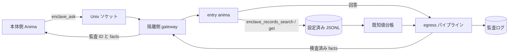

<!-- 自動翻訳ファイル・編集禁止 (AUTO-TRANSLATED, DO NOT EDIT). 正本: docs/ja/enclave.md -->
<!-- i18n: source-sha256=7b3f837620dd32802c843289512bc027ee16b6ba55c1ccb5f815352959df9e07 generated=2026-10-06 engine=luna model=gpt-6-luna-2026-09-22 translator=2 -->

> Commit checked: f448d7b0

# Building and Operating an Enclave

An Enclave is a mechanism for isolating Anima that handle SaaS personal information and similar data from the main runtime environment. Data access is limited to JSONL files on the isolated side, and communication with the main system is limited to Unix domain sockets. Responses returned externally are inspected by the egress pipeline, and you can review aggregate results and audit records.

## Overview



The isolated-side `enclave_records_search` and `enclave_records_get` read only configured datasets. Before responding, they register the `sensitive_fields` of the records they return in the known-value ledger. Dataset paths are restricted to within `ANIMAWORKS_DATA_DIR`. The JSONL contents are never returned to the host, and the Web UI displays only the connection status and the day's counts of successful and blocked requests.

## OS Users and Groups

The following is an example for Linux. User, group, and systemd operations must be performed with administrator privileges.

```bash
groupadd --system animaworks-enclave
useradd --system --create-home --home-dir /home/aw-enclave \
  --gid animaworks-enclave --shell /usr/sbin/nologin aw-enclave
```

Add the OS user that the main-side service uses to connect to the socket to the group. Replace `<host-user>` with the actual username of the main-side service.

```bash
HOST_USER=host-service-user  # 本体側サービスの実ユーザー名に置き換える
usermod --append --groups animaworks-enclave "$HOST_USER"
id -u "$HOST_USER"
```

Specify the displayed UID as `allowed_peer_uids` on the isolated side. After adding the user to the group, restart the main-side service so that the new supplementary group takes effect. The isolated-side data directory and anima directory must be owned by the runtime user and have permissions that prevent other users from reading them. If a startup guard is violated, `doctor` displays the reason.

## Isolated-side configuration

Set `enclave` in the isolated user's `~/.animaworks/config.json`. `datasets.<name>.path` is a relative path from the data directory and specifies the `.jsonl` file. Items not in `searchable_fields` are not included in search.

```json
{
  "enclave": {
    "enabled": true,
    "name": "saas-data",
    "socket_path": "/run/animaworks-enclave/aw-enclave.sock",
    "socket_group": "animaworks-enclave",
    "entry_anima": "entry-anima",
    "allowed_peer_uids": [1001],
    "allowed_llm_credentials": ["anthropic"],
    "max_concurrency": 2,
    "request_timeout_s": 900,
    "datasets": {
      "customers": {
        "path": "data/customers.jsonl",
        "id_field": "customer_id",
        "sensitive_fields": ["name", "kana", "address", "phone", "email"],
        "searchable_fields": ["customer_id", "name", "kana", "email"]
      },
      "tickets": {
        "path": "data/tickets.jsonl",
        "id_field": "ticket_id",
        "sensitive_fields": ["customer_id", "body"],
        "searchable_fields": ["ticket_id", "customer_id", "category", "body"]
      }
    },
    "egress": {
      "stages": [
        {"type": "known_values", "sources": []},
        {"type": "masker", "profile": "default"}
      ]
    }
  }
}
```

In `allowed_llm_credentials`, list only the authentication credential names actually used by each anima on the isolated side. `external_tasks.enabled` defaults to `true`, so set it to `false` on the isolated side. For newly created anima, `permissions.json` has `file_roots` set to `["/"]`, so change it to cover only necessary areas, such as the anima's own directory (otherwise, the startup guard will refuse startup). In isolation mode, do not start the Slack, Discord, Zoom, or GitHub Webhook gateways. Other startup guards must also be satisfied, so do not enable event exports or external message integrations, and restrict file access to the necessary scope in each anima's `permissions.json`. When restricting external tools for the entry anima, allow `enclave_records`.

For authentication, use the password mode of `auth.json` and configure it not to trust localhost. Do not store passwords in plaintext; set an application-generated Argon2id hash in `password_hash`.

```json
{
  "auth_mode": "password",
  "trust_localhost": false,
  "owner": {
    "username": "operator",
    "password_hash": "$argon2id$v=19$m=65536,t=3,p=4$<salt-and-hash>",
    "role": "owner"
  },
  "users": [],
  "sessions": {},
  "token_version": 1,
  "secret_key": ""
}
```

The value of `password_hash` is a placeholder indicating the format; do not use it as-is. If you created the authentication user in the Web UI's user settings, retain the generated hash.

## Startup with systemd

`templates/_shared/systemd/animaworks-enclave@.service` is a template that uses `%i` as the runtime username. Replace the virtual environment path and port in `ExecStart` to match the installation location, then place it in the systemd unit directory with administrator privileges.

```bash
install -m 0644 templates/_shared/systemd/animaworks-enclave@.service \
  /etc/systemd/system/animaworks-enclave@.service
systemctl daemon-reload
systemctl enable --now animaworks-enclave@aw-enclave.service
```

The template sets `User=%i`, a dedicated `RuntimeDirectory`, `UMask=0077`, `NoNewPrivileges=yes`, `PrivateTmp=yes`, and `ProtectSystem=strict`. Allow writes only to `/home/%i/.animaworks`, and expose only that user's home directory using `ProtectHome=tmpfs` and `BindPaths=/home/%i`. Set the example HTTP port to a value that does not conflict with the main side. Since the gateway communicates over a Unix socket, limit the HTTP bind address to loopback.

## Main-Side Connection Configuration

Register the connection destination in `config.json` on the main side. `allowed_animas` is the allow-list of main-side anima that can call `enclave_ask`. An empty list grants access to no one.

`allowed_animas` is an application-layer restriction. The OS boundary is enforced by the socket's group permissions (0660) and the source uid that the gateway verifies at `SO_PEERCRED` (`allowed_peer_uids`); any process with the same uid can connect to the socket. Minimize the number of users on the main side that belong to the socket's group.

```json
{
  "enclaves": {
    "saas-data": {
      "socket_path": "/run/animaworks-enclave/aw-enclave.sock",
      "allowed_animas": ["host-assistant"],
      "timeout_s": 900
    }
  }
}
```

If external tools are restricted in the main-side anima's `permissions.json`, add the module name `enclave` to `external_tools.allow`.

```json
{
  "external_tools": {
    "allow_all": false,
    "allow": ["enclave"],
    "deny": []
  }
}
```

## Inspection and Auditing

Run the following on the isolated side. `doctor` checks startup guards, the socket type, mode, and group, the gateway's `/v1/health`, egress pipeline configuration, and the imports of `fugashi` and `ipadic`. If `enclaves` is configured on the main side, it also checks each socket's connection and health response. If there is a problem, it exits with code 1; `--json` returns machine-readable results.

```bash
animaworks enclave doctor
animaworks enclave doctor --json
animaworks enclave status
```

`status` outputs only the day's counts of successful and blocked requests, and does not display the contents of questions or answers. The egress audit log is saved to `~/.animaworks/enclave/audit/egress/YYYYMMDD.jsonl`, and the known-value ledger to `~/.animaworks/enclave/ledger/known_values.jsonl`. Since the audit log includes the facts being processed, maintain access permissions on the files and their parent directories, and do not copy them outside the isolated environment.

## Verifying Operation with Mock Data

The mock data generation script uses a fixed seed to regenerate the same 100 customer records and 300 inquiry tickets. Some tickets include names or phone numbers in their contents. Do not use real data, and place the output in the isolated-side data directory.

```bash
DATA_DIR="$HOME/.animaworks"
uv run python scripts/enclave/make_mock_dataset.py --out "$DATA_DIR/data"
```

Confirm that `datasets` in the isolated-side config points to the above `data/customers.jsonl` and `data/tickets.jsonl`, and make `enclave_records_search` and `enclave_records_get` available to the entry anima. Then do the following:

1. On the isolated side, run `animaworks enclave doctor` and check the status of the guards and gateway.
2. Register the connection destination in `config.json` on the main side, and allow `enclave` for the main-side anima.
3. Run `animaworks-tool enclave ask --enclave saas-data --question "問い合わせをカテゴリ別に要約して"` from the main side. Confirm that the entry anima searches the mock data and returns a response that has passed egress inspection.
4. On the isolated side, run `animaworks enclave status` and confirm that the success count has increased. The Web UI home screen displays only the connection status and aggregate counts.
