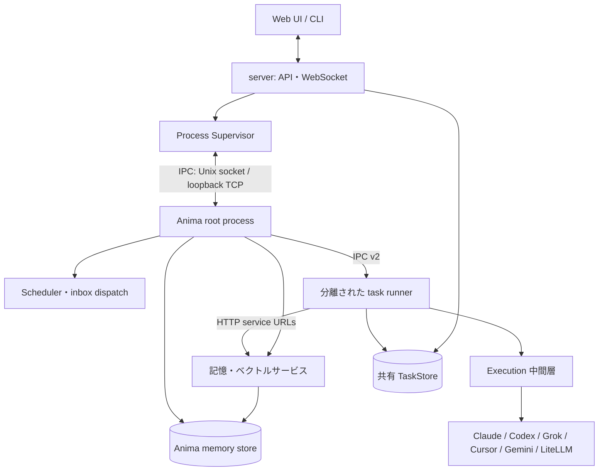

> 確認したコミット: b304b7dc

# アーキテクチャ

AnimaWorks は、HTTP API と Web UI を提供する server、各 Anima のプロセスを管理する supervisor、Anima ごとの root process、要求ごとに分離される task runner、複数の LLM 実行エンジンで構成される。記憶の検索・更新とタスクの永続化は、それぞれの共有境界を通じて扱う。

## リポジトリの構成

`core/` の主要パッケージは次のとおりである。モジュール単位の一覧は[モジュールリファレンス](../reference/modules.md)を参照する。

| パッケージ | 役割 |
|---|---|
| `core.agent` | エージェントの会話サイクル、executor、事前コンテキスト構築 |
| `core.anima` | Anima の実行時オブジェクト、メッセージ、heartbeat、ライフサイクル |
| `core.auth` | ユーザー認証とセッション |
| `core.config` | 設定スキーマ、読み込み、解決、移行 |
| `core.execution` | エンジン共通イベント、セッション、プロセス、watchdog、tool evidence |
| `core.i18n` | ローカライズ文字列と翻訳関数 |
| `core.infra` | 起動準備、ログ、ランタイム基盤 |
| `core.integrations` | 外部サービスとの接続アダプター |
| `core.lifecycle` | 共通ライフサイクル処理と Anima 統合 |
| `core.mcp` | AnimaWorks のツールを MCP 経由で公開するサーバー |
| `core.memory` | 会話記録、長期記憶、検索、記憶の保守 |
| `core.messaging` | 内部メッセージ、共有チャネル、外部宛て送信 |
| `core.migrations` | ランタイムデータの段階的な移行 |
| `core.notification` | 人間向け通知と対話型確認 |
| `core.org` | 会社、組織、workspace の解決 |
| `core.platform` | OS・プロセス・ロック・ファイル操作の差異吸収 |
| `core.prompt` | system prompt と tool guide の組み立て |
| `core.skills` | スキルの索引、選択、ライフサイクル |
| `core.supervisor` | Anima と task runner のプロセス管理、IPC、scheduler |
| `core.tasks` | 永続タスク、実行キュー、委任、外部タスク収集 |
| `core.tooling` | 内部ツールの定義、実行ハンドラー、権限検査 |
| `core.tools` | `core.integrations` の互換エイリアス（旧パッケージ名。`animaworks-tool` のエントリポイントとして残す） |
| `core.usage` | 利用量とコストの集計 |
| `core.voice` | 音声入出力と音声会話 |

`server/` は FastAPI アプリケーション、ルート、ゲートウェイ、配信する Web UI を置く。`cli/` は `animaworks` コマンドと端末 UI を置く。`templates/` はロケール別の prompt、Anima 雛形、共有設定雛形を保持する。

## ランタイムデータ

既定のデータルートは `~/.animaworks/` である。環境変数 `ANIMAWORKS_DATA_DIR`、または CLI の `--data-dir` で変更できる。コードは `core/paths.py` を通してルートと配下のパスを解決する。

| パス | 用途 |
|---|---|
| `config.json` | アプリケーション全体の設定 |
| `models.json` | モデル名の追加パターンやモデル別メタデータ |
| `permissions.global.json` | 全 Anima に適用する共通の権限制約 |
| `animas/{name}/` | 個別 Anima の設定、記憶、状態。詳細は[Anima のファイル](anima-files.md)を参照 |
| `shared/` | inbox、共有チャネル、TaskStore など複数 Anima 間のデータ |
| `common_knowledge/` | Anima 間で共有する知識資料 |
| `common_skills/` | 共通スキル |
| `logs/` | server、Anima、task runner のログ |

各 Anima の per-anima 設定の正本は `status.json` であり、モデル関連キーの意味は[設定リファレンス](../reference/config.md)を参照する。設定キー全体をこの章では列挙しない。
