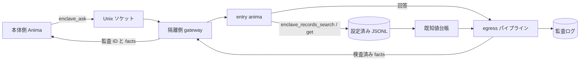

> 確認したコミット: f448d7b0

# Enclave の構築と運用

Enclave は、SaaS の個人情報などを扱う Anima を本体の実行環境から分離する仕組みである。データ参照は隔離側の JSONL ファイルに限定し、本体との通信は Unix ドメインソケットに限定する。外部へ返す回答は egress パイプラインで検査され、結果の集計と監査記録を確認できる。

## 概要



隔離側の `enclave_records_search` と `enclave_records_get` は設定済みデータセットだけを読み、返すレコードの `sensitive_fields` を既知値台帳へ登録してから応答する。データセットのパスは `ANIMAWORKS_DATA_DIR` 内に制限される。ホスト側には JSONL の本文を返さず、Web UI には接続状態と当日の成功・遮断件数だけを表示する。

## OS ユーザーとグループ

以下は Linux での例である。ユーザー・グループおよび systemd の操作は管理者権限で行う。

```bash
groupadd --system animaworks-enclave
useradd --system --create-home --home-dir /home/aw-enclave \
  --gid animaworks-enclave --shell /usr/sbin/nologin aw-enclave
```

本体側サービスがソケットへ接続する OS ユーザーをグループに追加する。`<host-user>` は本体側サービスの実ユーザー名に置き換える。

```bash
HOST_USER=host-service-user  # 本体側サービスの実ユーザー名に置き換える
usermod --append --groups animaworks-enclave "$HOST_USER"
id -u "$HOST_USER"
```

表示された UID を隔離側の `allowed_peer_uids` に指定する。グループ追加後は、本体側サービスを再起動して新しい補助グループを反映する。隔離側のデータディレクトリと anima ディレクトリは、実行ユーザーが所有し、他ユーザーから読めない権限にする。起動時ガードに違反があれば `doctor` が理由を表示する。

## 隔離側の設定

隔離ユーザーの `~/.animaworks/config.json` に `enclave` を設定する。`datasets.<name>.path` は data directory からの相対パスであり、`.jsonl` ファイルを指定する。`searchable_fields` にない項目は検索対象にならない。

```json
{
  "enclave": {
    "enabled": true,
    "name": "saas-data",
    "socket_path": "/run/animaworks-enclave/aw-enclave.sock",
    "socket_group": "animaworks-enclave",
    "entry_anima": "entry-anima",
    "allowed_peer_uids": [1001],
    "allowed_llm_credentials": ["anthropic"],
    "max_concurrency": 2,
    "request_timeout_s": 900,
    "datasets": {
      "customers": {
        "path": "data/customers.jsonl",
        "id_field": "customer_id",
        "sensitive_fields": ["name", "kana", "address", "phone", "email"],
        "searchable_fields": ["customer_id", "name", "kana", "email"]
      },
      "tickets": {
        "path": "data/tickets.jsonl",
        "id_field": "ticket_id",
        "sensitive_fields": ["customer_id", "body"],
        "searchable_fields": ["ticket_id", "customer_id", "category", "body"]
      }
    },
    "egress": {
      "stages": [
        {"type": "known_values", "sources": []},
        {"type": "masker", "profile": "default"}
      ]
    }
  }
}
```

`allowed_llm_credentials` には、隔離側の各 anima が実際に使う認証情報名だけを列挙する。`external_tasks.enabled` は初期値が `true` なので、隔離側では `false` にする。新しく作った anima の `permissions.json` は `file_roots` が `["/"]` になっているため、anima 自身のディレクトリなど必要な範囲に書き換える（そのままだと起動時ガードが起動を拒否する）。隔離モードでは Slack・Discord・Zoom・GitHub Webhook のゲートウェイを起動しない。ほかの起動時ガードも満たす必要があるため、イベントエクスポートや外部メッセージ連携を有効にせず、各 anima の `permissions.json` でファイルアクセスを必要な範囲に制限する。entry anima の外部ツールを制限する場合は `enclave_records` を許可する。

認証には `auth.json` の password モードを使い、localhost を信頼しない設定にする。パスワードの平文は保存せず、`password_hash` にはアプリが生成した Argon2id ハッシュを設定する。

```json
{
  "auth_mode": "password",
  "trust_localhost": false,
  "owner": {
    "username": "operator",
    "password_hash": "$argon2id$v=19$m=65536,t=3,p=4$<salt-and-hash>",
    "role": "owner"
  },
  "users": [],
  "sessions": {},
  "token_version": 1,
  "secret_key": ""
}
```

`password_hash` の値は形式を示すプレースホルダーであり、そのまま使用しない。認証ユーザーを Web UI のユーザー設定で作成した場合は、生成されたハッシュを保持する。

## systemd での起動

`templates/_shared/systemd/animaworks-enclave@.service` は `%i` を実行ユーザー名として使うテンプレートである。`ExecStart` の仮想環境パスとポートを配置先に合わせて置き換え、管理者権限で systemd の unit ディレクトリへ配置する。

```bash
install -m 0644 templates/_shared/systemd/animaworks-enclave@.service \
  /etc/systemd/system/animaworks-enclave@.service
systemctl daemon-reload
systemctl enable --now animaworks-enclave@aw-enclave.service
```

テンプレートは `User=%i`、専用の `RuntimeDirectory`、`UMask=0077`、`NoNewPrivileges=yes`、`PrivateTmp=yes`、`ProtectSystem=strict` を設定する。書き込み先は `/home/%i/.animaworks` のみにし、`ProtectHome=tmpfs` と `BindPaths=/home/%i` で当該ユーザーの home だけを公開する。例の HTTP ポートは本体側と競合しない値にする。gateway は Unix ソケットで通信するため、HTTP の bind address は loopback に限定する。

## 本体側の接続設定

本体側の `config.json` に接続先を登録する。`allowed_animas` は `enclave_ask` を呼べる本体側 anima の allow-list である。空のリストは誰も許可しない。

`allowed_animas` はアプリ層の制限である。OS の境界はソケットのグループ権限（0660）と、gateway が `SO_PEERCRED` で確かめる接続元 uid（`allowed_peer_uids`）で、同じ uid のプロセスはどれもソケットに接続できる。本体側でソケットのグループに入れるユーザーは最小限にする。

```json
{
  "enclaves": {
    "saas-data": {
      "socket_path": "/run/animaworks-enclave/aw-enclave.sock",
      "allowed_animas": ["host-assistant"],
      "timeout_s": 900
    }
  }
}
```

本体側 anima の `permissions.json` で外部ツールを制限している場合、`external_tools.allow` にモジュール名 `enclave` を追加する。

```json
{
  "external_tools": {
    "allow_all": false,
    "allow": ["enclave"],
    "deny": []
  }
}
```

## 点検と監査

隔離側では以下を実行する。`doctor` は起動時ガード、ソケットの種類・mode・グループ、gateway の `/v1/health`、egress パイプライン設定、`fugashi` と `ipadic` の import を確認する。本体側で `enclaves` を設定している場合は、各ソケットの接続と health 応答も確認する。問題があると exit code 1 になり、`--json` では機械可読な結果を返す。

```bash
animaworks enclave doctor
animaworks enclave doctor --json
animaworks enclave status
```

`status` は当日の成功・遮断件数だけを出力し、質問や回答の本文を表示しない。egress 監査ログは `~/.animaworks/enclave/audit/egress/YYYYMMDD.jsonl`、既知値台帳は `~/.animaworks/enclave/ledger/known_values.jsonl` に保存される。監査ログには処理対象の facts が含まれるため、ファイルと親ディレクトリのアクセス権を維持し、隔離環境外へコピーしない。

## 実データ源の接続

隔離側から本番 MySQL 互換 DB を読み取り専用で参照できます。接続は扱うデータを実在の例で書けません（公開リポジトリのため、顧客名・業種・実在のホスト名・IP・アカウント ID は書かないでください）。以下はすべて `example` を使ったプレースホルダーです。

### 秘密の置き方

DB パスワードと AWS アクセスキーは、`enclave.secrets_dir` か systemd の `LoadCredential=` で隔離プロセスにだけ渡します。秘密ファイルは root 所有・`0600` にしてください。パスワードの漏えいを防ぐため、設定ファイルに平文で書いてはいけません。

- systemd を使う場合: `animaworks-enclave@.service` の `LoadCredential=` で `/etc/credstore/animaworks-enclave/<name>/db-password` などを読み込み、`$CREDENTIALS_DIRECTORY` から読めるようにします。
- 別のディレクトリを `enclave.secrets_dir` に指定した場合も同じ形式で、名前をファイル名にした値を配置します。

```bash
install -m 0600 -o root -g root db-password /etc/credstore/animaworks-enclave/aw-enclave/db-password
install -m 0600 -o root -g root aws-creds  /etc/credstore/animaworks-enclave/aw-enclave/aws-creds
```

### sql_sources 設定例

`enclave.sql_sources` に読み取り専用のデータソースを定義します。`password_secret` は秘密の名前です。`tunnel` を設定すると、SSM Session Manager のポート転送（踏み台経由）で RDS へ接続します。`aws_secret` の中身は `{"aws_access_key_id": "...", "aws_secret_access_key": "..."}` の JSON です。

```json
{
  "enclave": {
    "enabled": true,
    "secrets_dir": null,
    "sql_sources": {
      "main-db": {
        "driver": "mysql",
        "host": "example.rds.example.amazonaws.com",
        "port": 3306,
        "database": "example_db",
        "user": "enclave_reader",
        "password_secret": "db-password",
        "ssl": true,
        "max_rows": 200,
        "timeout_s": 30,
        "cell_max_chars": 2000,
        "ledger_exempt_columns": ["id", ".*_id", "status"],
        "tunnel": {
          "type": "ssm_port_forward",
          "region": "example-region-1",
          "target_tag_name": "example-bastion-tag",
          "aws_secret": "aws-creds",
          "plugin_path": "/usr/local/bin/session-manager-plugin",
          "idle_shutdown_s": 600
        }
      }
    }
  }
}
```

`ledger_exempt_columns` は正規表現のリストで、**出口で伏字にしない列（ID・状態など）**を指定します。ここで指定した列の値は既知値台帳へ積まれません。残りの文字列セルは、数値・ISO 日時・真偽値だけのものを除いて、結果を返す前に既知値台帳へ登録され、回答に再出現したときに伏字になります。SSL は既定で必須です。RDS の CA を使う場合は `ssl_ca` に CA のパス、ホスト名検証の無効化が必要なら `ssl_verify_identity: false`（既定）のままトンネル越しのためホスト名一致しない点を考慮してください。

### doctor の見方

`sql_sources` を設定すると、`animaworks enclave doctor` に各ソースの検査が追加されます。起動時ガードは秘密が未配置でも起動を止めず、doctor で `fail` を表示します（秘密は後から置ける運用のため）。

- `<name>.secrets`: `password_secret` と `tunnel.aws_secret` の秘密ファイルが読めるか。
- `<name>.plugin`: `session-manager-plugin` が実行可能か。
- `<name>.deps`: `pymysql` と `boto3` が import できるか。

実際の DB・AWS には接続しません。

## AWS の読み取りソース

`enclave.aws_sources` には CloudWatch Logs、RDS Performance Insights、RDS ログファイル、S3 の読み取り対象を登録します。認証情報は `aws_secret` で指定した秘密ファイルから読み込み、設定ファイルやツール出力には AWS キーを含めません。下記の名前と値はすべて説明用のプレースホルダーです。

```json
{
  "enclave": {
    "enabled": true,
    "secrets_dir": null,
    "aws_sources": {
      "observability": {
        "region": "example-region-1",
        "aws_secret": "aws-readonly",
        "log_groups": ["/example/application/*"],
        "pi_resource_id": "db-example-resource",
        "rds_instance_id": "db-example-instance",
        "s3_buckets": ["example-placeholder-bucket"],
        "max_bytes": 200000,
        "ledger_register": true,
        "ledger_exempt_keys": [
          "level", "timestamp", "time", "message_type", "message", "msg",
          "error", "exception", "stack_trace", "status", "method", "path",
          "route", "duration", "request_id", "requestid", "req_id", "reqid",
          "trace_id", "traceid", "correlation_id", "@timestamp", "@message",
          "@ptr", "@log", "@logstream", "@ingestiontime", "eventid", "logstreamname"
        ]
      }
    }
  }
}
```

秘密 `aws-readonly` のファイル内容は次の JSON 形式にします。値は例示用のプレースホルダーであり、そのまま使わないでください。

```json
{"aws_access_key_id":"<access-key>","aws_secret_access_key":"<secret-key>"}
```

`log_groups` は完全一致か、末尾の `*` による前方一致で許可します。PI・RDS の各ツールはそれぞれ設定されたリソース ID だけを使い、S3 は `s3_buckets` に列挙したバケットだけにアクセスします。時刻は ISO8601 または `-1h` / `-24h` の相対指定です。Logs Insights クエリは最大 60 秒ポーリングし、各ツールの返却テキストは `max_bytes` で制限されます。テキスト以外、または上限を超える S3 オブジェクトは本文をツール応答に含めず、隔離 data directory の `enclave/downloads/<bucket>/<key-sha256>` に mode `0600` で保存します。

`ledger_register` が有効でも、自由文すべてを既知値台帳へ登録するわけではありません。JSON として解釈できるログの各行は、`ledger_exempt_keys` に含まれない文字列値だけを登録します。PI の SQL 全文は文字列リテラル（`'...'`）の内容だけを登録します。JSON ではない通常のログ本文やその他の自由文は登録されず、出口の masker と `regex_denylist` が担います。このため、自由文の伏字化は既知値台帳だけでは保証されません。`ledger_register: false` にすると AWS 読み取り結果の登録を無効化できます。

AWS ソースの `doctor` 検査は `aws_sources.<name>.secret` と `.deps`（`boto3`）を確認します。実 AWS へ接続せず、秘密の存在と SDK の import 可否だけを調べます。

## モックデータでの動作確認

モックデータ生成スクリプトは固定シードを使い、同じ 100 件の顧客データと 300 件の問い合わせチケットを再生成する。氏名や電話番号を本文に含むチケットもある。実データは使用せず、出力先は隔離側の data directory 内にする。

```bash
DATA_DIR="$HOME/.animaworks"
uv run python scripts/enclave/make_mock_dataset.py --out "$DATA_DIR/data"
```

隔離側 config の `datasets` が上記の `data/customers.jsonl` と `data/tickets.jsonl` を指すことを確認し、entry anima が `enclave_records_search` と `enclave_records_get` を利用できるようにする。続いて次を行う。

1. 隔離側で `animaworks enclave doctor` を実行し、ガードと gateway の状態を確認する。
2. 本体側の `config.json` に接続先を登録し、本体側 anima に `enclave` を許可する。
3. 本体側から `animaworks-tool enclave ask --enclave saas-data --question "問い合わせをカテゴリ別に要約して"` を実行する。entry anima がモックデータを検索し、egress 検査済みの回答を返すことを確認する。
4. 隔離側で `animaworks enclave status` を実行し、成功件数が増えたことを確認する。Web UI のホーム画面には接続状態と集計件数だけが表示される。
