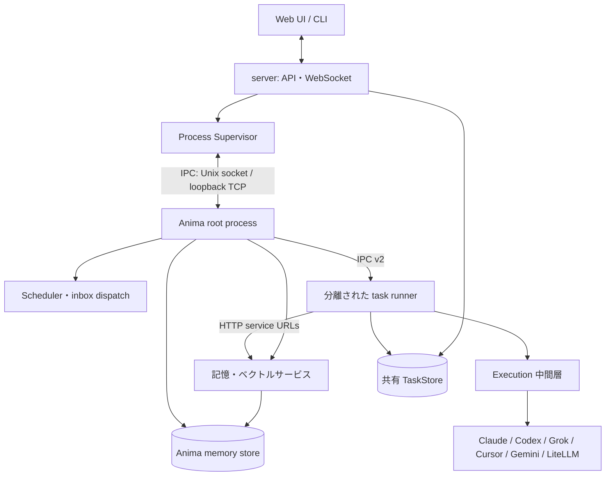

<!-- 自動翻訳ファイル・編集禁止 (AUTO-TRANSLATED, DO NOT EDIT). 正本: docs/ja/architecture/index.md -->
<!-- i18n: source-sha256=8f48d029c96eb2d3cb177b92621564f08cacdd8ac5fbf554c6262486776aca78 generated=2026-09-27 engine=local model=deepseek-v4-flash translator=2 -->

> 확인된 커밋: b304b7dc
# 아키텍처

AnimaWorks는 HTTP API와 Web UI를 제공하는 server, 각 Anima의 프로세스를 관리하는 supervisor, Anima별 root process, 요청마다 분리되는 task runner, 여러 LLM 실행 엔진으로 구성된다. 기억의 검색·업데이트와 작업의 영속화는 각각의 공유 경계를 통해 처리한다.

## 저장소 구성

`core/`의 주요 패키지는 다음과 같다. 모듈 단위 목록은 [모듈 참조](../reference/modules.md)를 참조한다.

| 패키지 | 역할 |
|---|---|
| `core.agent` | 에이전트의 대화 사이클, executor, 사전 컨텍스트 구축 |
| `core.anima` | Anima의 런타임 객체, 메시지, heartbeat, 라이프사이클 |
| `core.auth` | 사용자 인증과 세션 |
| `core.config` | 설정 스키마, 로드, 해결, 마이그레이션 |
| `core.execution` | 엔진 공통 이벤트, 세션, 프로세스, watchdog, tool evidence |
| `core.i18n` | 로컬라이즈 문자열과 번역 함수 |
| `core.infra` | 시작 준비, 로그, 런타임 기반 |
| `core.integrations` | 외부 서비스와의 연결 어댑터 |
| `core.lifecycle` | 공통 라이프사이클 처리와 Anima 통합 |
| `core.mcp` | AnimaWorks의 도구를 MCP를 통해 공개하는 서버 |
| `core.memory` | 대화 기록, 장기 기억, 검색, 기억의 유지보수 |
| `core.messaging` | 내부 메시지, 공유 채널, 외부 대상 전송 |
| `core.migrations` | 런타임 데이터의 단계적 마이그레이션 |
| `core.notification` | 인간 대상 알림과 대화형 확인 |
| `core.org` | 회사, 조직, workspace의 해결 |
| `core.platform` | OS·프로세스·잠금·파일 작업의 차이 흡수 |
| `core.prompt` | system prompt와 tool guide의 조립 |
| `core.skills` | 스킬의 인덱스, 선택, 라이프사이클 |
| `core.supervisor` | Anima와 task runner의 프로세스 관리, IPC, scheduler |
| `core.tasks` | 영속 작업, 실행 큐, 위임, 외부 작업 수집 |
| `core.tooling` | 내부 도구의 정의, 실행 핸들러, 권한 검사 |
| `core.tools` | `core.integrations`의 호환 별칭 (이전 패키지 이름. `animaworks-tool`의 엔트리 포인트로 유지) |
| `core.usage` | 사용량과 비용의 집계 |
| `core.voice` | 음성 입출력과 음성 대화 |

`server/`은 FastAPI 애플리케이션, 라우트, 게이트웨이, 배포하는 Web UI를 둔다. `cli/`은 `animaworks` 명령과 터미널 UI를 둔다. `templates/`은 로케일별 prompt, Anima 템플릿, 공유 설정 템플릿을 보유한다.
## 런타임 데이터

기본 데이터 루트는 `~/.animaworks/`이다. 환경 변수 `ANIMAWORKS_DATA_DIR` 또는 CLI의 `--data-dir`로 변경할 수 있다. 코드는 `core/paths.py`을 통해 루트와 하위 경로를 해결한다.

| 경로 | 용도 |
|---|---|
| `config.json` | 애플리케이션 전체 설정 |
| `models.json` | 모델 이름의 추가 패턴이나 모델별 메타데이터 |
| `permissions.global.json` | 모든 Anima에 적용하는 공통 권한 제약 |
| `animas/{name}/` | 개별 Anima의 설정, 기억, 상태. 자세한 내용은 [Anima의 파일](anima-files.md)을 참조 |
| `shared/` | inbox, 공유 채널, TaskStore 등 여러 Anima 간의 데이터 |
| `common_knowledge/` | Anima 간에 공유하는 지식 자료 |
| `common_skills/` | 공통 스킬 |
| `logs/` | server, Anima, task runner의 로그 |

각 Anima의 per-anima 설정의 원본은 `status.json`이며, 모델 관련 키의 의미는 [설정 참조](../reference/config.md)를 참조한다. 설정 키 전체는 이 장에서 열거하지 않는다.