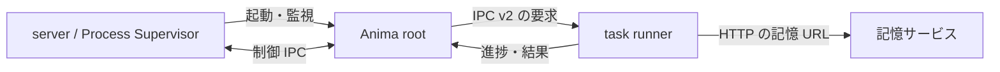

<!-- 自動翻訳ファイル・編集禁止 (AUTO-TRANSLATED, DO NOT EDIT). 正本: docs/ja/architecture/process.md -->
<!-- i18n: source-sha256=c13b2a6ee7d7489c293fb54000a394e0170b3a4c9fac8f7cc3ddbee4cc825829 generated=2026-09-30 engine=local model=deepseek-v4-flash translator=2 -->

> 확인된 커밋: b304b7dc

# 프로세스 구성과 통신

런타임은 phase3의 프로세스 구성을 전제로 한다. server는 API와 WebSocket을 제공하며, 같은 server 내의 Process Supervisor가 Anima root process를 관리한다. root는 scheduler와 제어용 IPC를 가지며, 대화나 백그라운드 처리를 분리된 task runner에 전달한다.

## 시작과 IPC

`core/supervisor/manager.py`이 root process를 시작하고, `core/supervisor/runner.py`이 Anima의 런타임 객체와 각 서비스를 초기화한다. `core/supervisor/task_runner_supervisor.py`는 요청별로 독립된 task runner를 시작하며, heartbeat, cron, inbox, 채팅, greet, background task 등을 분리하여 실행한다.

root와 server의 제어 통신은 `core/supervisor/ipc.py`을 통해 이루어진다. `core/supervisor/ipc_v2.py`는 root와 task runner의 요청·응답을 처리하고, `core/supervisor/transport.py`가 연결 방식을 선택한다. 일반적으로 Unix domain socket을 사용하며, Windows에서는 loopback TCP를 사용한다. Unix socket의 경로가 OS의 길이 상한을 초과하는 경우에도 loopback TCP로 전환한다.

벡터 검색에 필요한 연결 대상은 server가 시작 시 URL로 준비하여 task runner에 전달한다. root가 기억 데이터에 대한 접근을 관리하고, 하위 프로세스에서는 서비스를 통해 검색한다. 검색 경로의 세부 사항은 `docs/ja/memory/retrieval.md`을 참조한다.

## 시작 준비와 readiness

server는 시작 직후 모든 API를 사용 가능하게 하지 않고, RAG의 preflight와 Anima process의 시작을 진행한다. 준비 중에는 startup progress를 업데이트하고, readiness gate가 진행 상황 화면을 반환한다. Anima root는 IPC endpoint 생성 후에도 초기화를 계속하며, ping이 ready를 반환한 후 supervisor의 확인을 받는다. 시작 시의 무거운 준비와 의존 서비스의 초기화가 끝날 때까지 공개 readiness는 ready가 되지 않는다.

## 비정상 종료와 재시작

`core/supervisor/restart_state.py`의 상태 머신이 Anima별 연속 실패 횟수, 다음 재시작 시각, 최종 오류를 일원 관리한다. 규정 횟수의 실패 후에는 UI에 FAILED를 표시하지만, 자동 복구는 계속된다. 재시작 간격은 지수 백오프로 연장되며, 상한은 30분이다. 안정적인 가동이 계속되면 실패 횟수를 리셋한다.

엔진의 이벤트 idle timeout은 engine event가 1200초 동안 도착하지 않는 경우에 적용된다. 이는 대화 전체의 실행 시간 상한이 아니다. task runner의 종료·응답 모니터링은 root 측의 supervisor가 담당한다.
