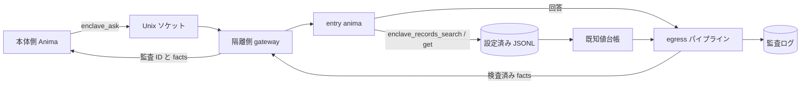

<!-- 自動翻訳ファイル・編集禁止 (AUTO-TRANSLATED, DO NOT EDIT). 正本: docs/ja/enclave.md -->
<!-- i18n: source-sha256=7b3f837620dd32802c843289512bc027ee16b6ba55c1ccb5f815352959df9e07 generated=2026-10-06 engine=luna model=gpt-6-luna-2026-09-22 translator=2 -->

> 확인한 커밋: f448d7b0

# Enclave 구축 및 운영

Enclave는 SaaS의 개인 정보 등을 다루는 Anima를 본체의 실행 환경에서 분리하는 메커니즘이다. 데이터 참조는 격리 측의 JSONL 파일로 제한하고, 본체와의 통신은 Unix 도메인 소켓으로 제한한다. 외부로 반환하는 답변은 egress 파이프라인에서 검사하며, 결과 집계와 감사 기록을 확인할 수 있다.

## 개요



격리 측의 `enclave_records_search`와 `enclave_records_get`는 설정된 데이터세트만 읽으며, 반환할 레코드의 `sensitive_fields`를 알려진 값 원장에 등록한 후 응답한다. 데이터세트 경로는 `ANIMAWORKS_DATA_DIR` 내로 제한된다. 호스트 측에는 JSONL 본문을 반환하지 않으며, Web UI에는 연결 상태와 당일 성공·차단 건수만 표시한다.

## OS 사용자 및 그룹

다음은 Linux에서의 예시다. 사용자·그룹 및 systemd 작업은 관리자 권한으로 수행한다.

```bash
groupadd --system animaworks-enclave
useradd --system --create-home --home-dir /home/aw-enclave \
  --gid animaworks-enclave --shell /usr/sbin/nologin aw-enclave
```

본체 측 서비스가 소켓에 연결하는 OS 사용자를 그룹에 추가한다. `<host-user>`는 본체 측 서비스의 실제 사용자 이름으로 바꾼다.

```bash
HOST_USER=host-service-user  # 本体側サービスの実ユーザー名に置き換える
usermod --append --groups animaworks-enclave "$HOST_USER"
id -u "$HOST_USER"
```

표시된 UID를 격리 측의 `allowed_peer_uids`로 지정한다. 그룹을 추가한 뒤에는 본체 측 서비스를 다시 시작해 새 보조 그룹을 반영한다. 격리 측 데이터 디렉터리와 anima 디렉터리는 실행 사용자가 소유하게 하고, 다른 사용자가 읽을 수 없도록 권한을 설정한다. 시작 시 가드를 위반하면 `doctor`에 이유가 표시된다.

## 격리 측 설정

격리 사용자의 `~/.animaworks/config.json`에 `enclave`을 설정한다. `datasets.<name>.path`는 data directory를 기준으로 한 상대 경로이며, `.jsonl` 파일을 지정한다. `searchable_fields`에 없는 항목은 검색 대상이 되지 않는다.

```json
{
  "enclave": {
    "enabled": true,
    "name": "saas-data",
    "socket_path": "/run/animaworks-enclave/aw-enclave.sock",
    "socket_group": "animaworks-enclave",
    "entry_anima": "entry-anima",
    "allowed_peer_uids": [1001],
    "allowed_llm_credentials": ["anthropic"],
    "max_concurrency": 2,
    "request_timeout_s": 900,
    "datasets": {
      "customers": {
        "path": "data/customers.jsonl",
        "id_field": "customer_id",
        "sensitive_fields": ["name", "kana", "address", "phone", "email"],
        "searchable_fields": ["customer_id", "name", "kana", "email"]
      },
      "tickets": {
        "path": "data/tickets.jsonl",
        "id_field": "ticket_id",
        "sensitive_fields": ["customer_id", "body"],
        "searchable_fields": ["ticket_id", "customer_id", "category", "body"]
      }
    },
    "egress": {
      "stages": [
        {"type": "known_values", "sources": []},
        {"type": "masker", "profile": "default"}
      ]
    }
  }
}
```

`allowed_llm_credentials`에는 격리 측의 각 anima가 실제로 사용하는 인증 정보 이름만 나열한다. `external_tasks.enabled`은 초기값이 `true`이므로 격리 측에서는 `false`으로 설정한다. 새로 만든 anima의 `permissions.json`은 `file_roots`가 `["/"]`으로 설정되어 있으므로 anima 자체의 디렉터리 등 필요한 범위로 변경한다. 그대로 두면 시작 시 가드가 시작을 거부한다. 격리 모드에서는 Slack·Discord·Zoom·GitHub Webhook 게이트웨이를 시작하지 않는다. 다른 시작 시 가드도 충족해야 하므로 이벤트 내보내기나 외부 메시지 연계를 활성화하지 말고, 각 anima의 `permissions.json`에서 파일 액세스를 필요한 범위로 제한한다. entry anima의 외부 도구를 제한하는 경우에는 `enclave_records`를 허용한다.

인증에는 `auth.json`의 password 모드를 사용하고, localhost를 신뢰하지 않도록 설정한다. 비밀번호 평문은 저장하지 않고, `password_hash`에는 앱이 생성한 Argon2id 해시를 설정한다.

```json
{
  "auth_mode": "password",
  "trust_localhost": false,
  "owner": {
    "username": "operator",
    "password_hash": "$argon2id$v=19$m=65536,t=3,p=4$<salt-and-hash>",
    "role": "owner"
  },
  "users": [],
  "sessions": {},
  "token_version": 1,
  "secret_key": ""
}
```

`password_hash`의 값은 형식을 나타내는 플레이스홀더이므로 그대로 사용하지 않는다. 인증 사용자를 Web UI의 사용자 설정에서 생성한 경우에는 생성된 해시를 유지한다.

## systemd로 시작하기

`templates/_shared/systemd/animaworks-enclave@.service`은 `%i`를 실행 사용자 이름으로 사용하는 템플릿이다. `ExecStart`의 가상 환경 경로와 포트를 배포 위치에 맞게 바꾼 뒤, 관리자 권한으로 systemd unit 디렉터리에 배치한다.

```bash
install -m 0644 templates/_shared/systemd/animaworks-enclave@.service \
  /etc/systemd/system/animaworks-enclave@.service
systemctl daemon-reload
systemctl enable --now animaworks-enclave@aw-enclave.service
```

템플릿은 `User=%i`, 전용 `RuntimeDirectory`, `UMask=0077`, `NoNewPrivileges=yes`, `PrivateTmp=yes`, `ProtectSystem=strict`를 설정한다. 쓰기 대상은 `/home/%i/.animaworks`만 허용하고, `ProtectHome=tmpfs` 및 `BindPaths=/home/%i`를 통해 해당 사용자의 home만 공개한다. 예시의 HTTP 포트는 본체 측과 충돌하지 않는 값으로 설정한다. gateway는 Unix 소켓으로 통신하므로 HTTP bind address는 loopback으로 제한한다.

## 본체 측 연결 설정

본체 측의 `config.json`에 연결 대상을 등록한다. `allowed_animas`은 `enclave_ask`를 호출할 수 있는 본체 측 anima의 allow-list다. 빈 목록이면 아무도 허용되지 않는다.

`allowed_animas`는 애플리케이션 계층의 제한이다. OS 경계는 소켓의 그룹 권한(0660)과 gateway가 `SO_PEERCRED`에서 확인하는 연결 원본 uid(`allowed_peer_uids`)로 정해지며, 같은 uid의 프로세스는 모두 소켓에 연결할 수 있다. 본체 측에서 소켓 그룹에 추가하는 사용자는 최소한으로 제한한다.

```json
{
  "enclaves": {
    "saas-data": {
      "socket_path": "/run/animaworks-enclave/aw-enclave.sock",
      "allowed_animas": ["host-assistant"],
      "timeout_s": 900
    }
  }
}
```

본체 측 anima의 `permissions.json`에서 외부 도구를 제한하는 경우, `external_tools.allow`에 모듈 이름 `enclave`을 추가한다.

```json
{
  "external_tools": {
    "allow_all": false,
    "allow": ["enclave"],
    "deny": []
  }
}
```

## 점검 및 감사

격리 측에서 다음을 실행한다. `doctor`은 시작 시 가드, 소켓의 종류·mode·그룹, gateway의 `/v1/health`, egress 파이프라인 설정, `fugashi` 및 `ipadic`의 import를 확인한다. 본체 측에서 `enclaves`를 설정한 경우에는 각 소켓의 연결과 health 응답도 확인한다. 문제가 있으면 exit code 1이 반환되고, `--json`에서는 기계 판독 가능한 결과를 반환한다.

```bash
animaworks enclave doctor
animaworks enclave doctor --json
animaworks enclave status
```

`status`은 당일 성공·차단 건수만 출력하며 질문이나 답변의 본문은 표시하지 않는다. egress 감사 로그는 `~/.animaworks/enclave/audit/egress/YYYYMMDD.jsonl`에, 알려진 값 원장은 `~/.animaworks/enclave/ledger/known_values.jsonl`에 저장된다. 감사 로그에는 처리 대상 facts가 포함되므로 파일과 상위 디렉터리의 접근 권한을 유지하고, 격리 환경 밖으로 복사하지 않는다.

## 모의 데이터로 동작 확인

모의 데이터 생성 스크립트는 고정 시드를 사용해 같은 고객 데이터 100건과 문의 티켓 300건을 다시 생성한다. 본문에 이름이나 전화번호가 포함된 티켓도 있다. 실제 데이터는 사용하지 말고, 출력 대상은 격리 측의 data directory 내로 지정한다.

```bash
DATA_DIR="$HOME/.animaworks"
uv run python scripts/enclave/make_mock_dataset.py --out "$DATA_DIR/data"
```

격리 측 config의 `datasets`이 위의 `data/customers.jsonl` 및 `data/tickets.jsonl`을 가리키는지 확인하고, entry anima가 `enclave_records_search` 및 `enclave_records_get`를 사용할 수 있도록 한다. 이어서 다음을 수행한다.

1. 격리 측에서 `animaworks enclave doctor`을 실행해 가드와 gateway의 상태를 확인한다.
2. 본체 측의 `config.json`에 연결 대상을 등록하고, 본체 측 anima에 `enclave`을 허용한다.
3. 본체 측에서 `animaworks-tool enclave ask --enclave saas-data --question "問い合わせをカテゴリ別に要約して"`을 실행한다. entry anima가 모의 데이터를 검색하고 egress 검사를 마친 답변을 반환하는지 확인한다.
4. 격리 측에서 `animaworks enclave status`을 실행해 성공 건수가 늘었는지 확인한다. Web UI 홈 화면에는 연결 상태와 집계 건수만 표시된다.
