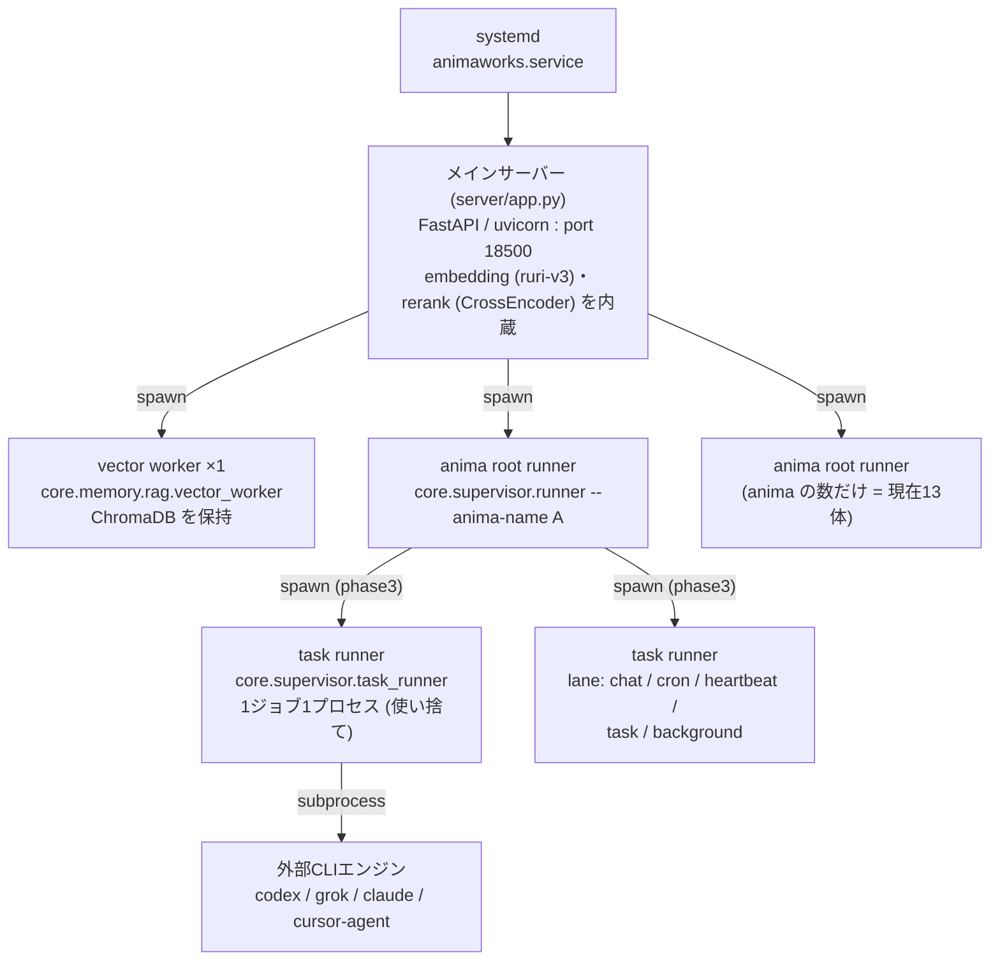
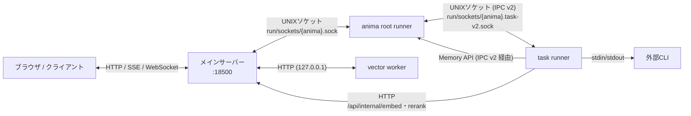
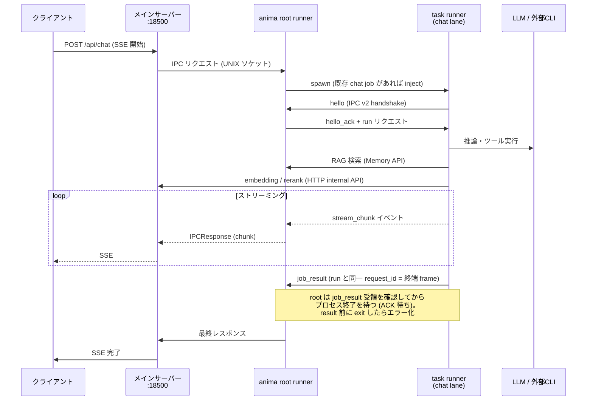
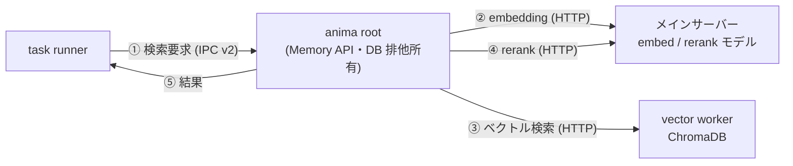

# プロセスアーキテクチャ

AnimaWorks の実行時プロセス構造のリファレンス。プロセス分離モデル（`process_model`、既定 = phase3）を前提に、
どのプロセスが何を担い、誰と何で通信するかをまとめる。

対応する詳細仕様: [docs/specs/20260807_process-model-flag.md](specs/20260807_process-model-flag.md) /
[docs/specs/20260807_ipc-v2-task-runner.md](specs/20260807_ipc-v2-task-runner.md)

## プロセスツリー全体像

| プロセス | 実体 | 多重度 | 役割 |
|---|---|---|---|
| メインサーバー | `server/app.py` (FastAPI, port 18500) | 1 | HTTP/SSE/WebSocket の玄関。embedding・rerank モデルをプロセス内スレッドプールで実行。全子プロセスの親 |
| vector worker | `core.memory.rag.vector_worker` | 1 | ChromaDB (SQLite ベース) の保持。HTTP API (`/query` `/upsert` 等) を提供。**GPU は使わない** |
| anima root runner | `core.supervisor.runner` | anima 数 (13) | anima 1体の常駐プロセス。IPC サーバ・スケジューラ・記憶 (Memory API) の排他所有者。**phase3 では LLM/外部CLI を一切実行しない** |
| task runner | `core.supervisor.task_runner` | ジョブ実行中のみ 0..N | 1ジョブ1プロセスの使い捨て。LLM 推論・ツール実行・外部CLI起動はすべてここ |
| 外部CLIエンジン | codex / grok / claude 等のバイナリ | 都度 | Mode C/S/X の推論実体。サンドボックス (Landlock/bwrap 相当) は CLI 自身が構築 |

GPU を使うのはメインサーバー 1 プロセスのみ（embedding + rerank モデル）。
子プロセスはすべて HTTP でメインサーバーに委譲するため、モデルの多重ロードは起きない。

## 通信経路

| 経路 | transport | 用途 |
|---|---|---|
| クライアント ⇔ server | HTTP + SSE + WebSocket | チャット送信、ストリーミング応答、状態配信 |
| server ⇔ anima root | UNIX ソケット `run/sockets/{anima}.sock` | チャット転送、ping/pong ヘルスチェック (10s 間隔、6 回失敗で respawn、busy hang 閾値 900s) |
| anima root ⇔ task runner | UNIX ソケット `run/sockets/{anima}.task-v2.sock`、IPC v2 (JSON Lines) | ジョブ実行指示、ストリーム中継、終端 ACK |
| server ⇔ vector worker | HTTP (127.0.0.1) | ベクトル検索の実体 (ChromaDB) |
| 子プロセス → server | HTTP `/api/internal/{embed,rerank,vector}` | `ANIMAWORKS_EMBED_URL` / `RERANK_URL` / `VECTOR_URL` 環境変数で注入。EMBED_URL 欠落時は fail-closed で起動拒否 |

## process_model の 3 段階

`status.json` の `process_model` フィールドが正本。**フィールド欠落 = phase3**（2026-08-07 改訂で既定化）。
legacy / phase2 は明示 opt-out 用。

| | legacy | phase2 | phase3 (既定) |
|---|---|---|---|
| LLM 実行場所 | root runner 内 | subflag 指定 lane のみ task runner | 全 lane を task runner (chat 含む) |
| root 内の LLM/外部CLI 経路 | あり | chat/greet/bootstrap は残る | **ゼロ** |
| ベクトル DB 所有 | global vector worker | 同左 | anima root が自 DB を排他所有 |
| task runner の RAG アクセス | — | vector proxy 経由 | root Memory API のみ (vector proxy は 409 拒否) |

phase3 の狙い: クラッシュ分離（LLM/CLI がハング・死亡しても root と DB は無傷）と、DB 書き込み主体の一本化（破損カスケードの根絶）。

## チャット実行シーケンス (phase3)

ポイント:

- **1 ジョブ = 1 task runner プロセス = 1 本の永続 duplex 接続**。ジョブ完了でプロセスごと消える
- 終端 frame (`job_result`) の ACK を root が待つため、子の早期 exit による応答喪失は起きない
  (result 未着でプロセスが先に死んだ場合は明示エラー)
- `task` / `background` lane のみ同時実行数がプールで制限される。chat / cron / heartbeat は無制限

## RAG 検索の経路

- モデル (embedding: ruri-v3 / rerank: CrossEncoder) はメインサーバー 1 か所にのみロード。
  子プロセスからは常に HTTP 委譲で、GPU 上のモデルは全フリートで 1 セット
- phase3 anima の DB 書き込みは root だけが行う。`/api/internal/vector/*` プロキシは
  phase3 anima に対してサーバー側で 409 拒否される (直アクセス防止)

## ライフサイクルと障害対応

- **起動**: server → vector worker + 全 anima root を並列 spawn。root は socket 即作成 → 重い初期化 →
  server が `ping` ポーリングで ready 判定 → `startup_ack`。zombie runner は pidfile から検出して SIGKILL
- **再起動ポリシー**: max_retries=3、backoff 30s。失敗時は空成功にせず `FAILED` として可視化
- **停止シーケンス**: IPC `shutdown` (5s) → SIGTERM → SIGKILL。停止前に子孫 CLI プロセスの PID を
  スナップショットし、オーファン化していれば個別 kill
- **graceful shutdown (SIGTERM)**: 新規ジョブ停止 → 各 task runner へ `grace` イベント →
  Journal flush/fsync → `grace_ack` → 自然終了
